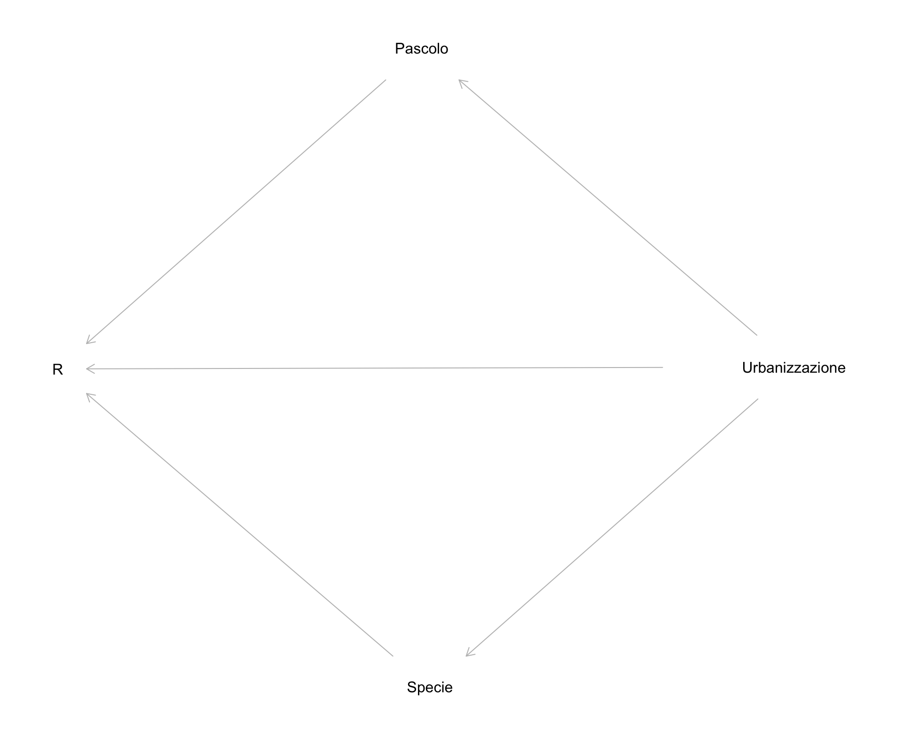
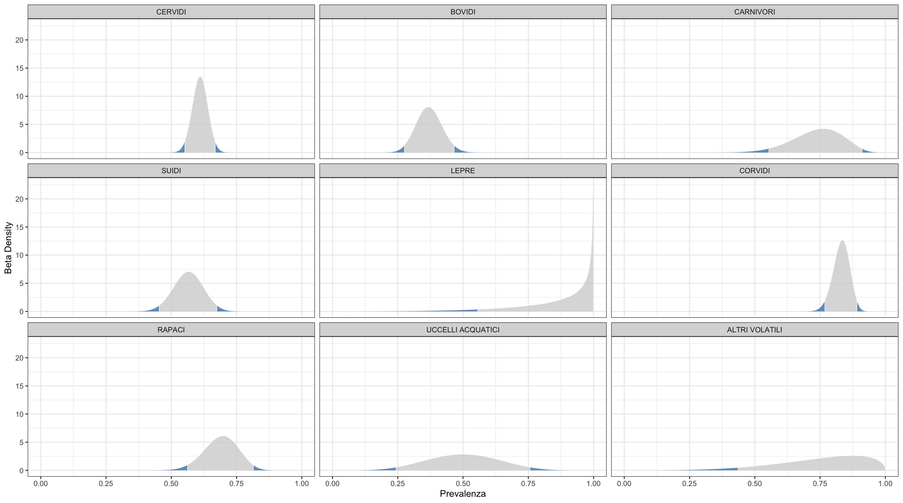

\listoffigures
\listoftables

### ELENCO DEI COLLABORATORI {-}

* **Dr. Tranquillo Vito** U.O. 1-Responsabile scientifico del progetto.Coordinamento delle U.O., Analisi statistica dei dati fenotipici. 
* **Dr. Fiocchi Alfredo** U.O. 1-Analisi microbiologiche e antibiogrammi.
* **Dr. Pongolini Stefano** U.O. 2-Coordinamento U.O. e attività di analisi metagenomiche
* **Dr. Bolzoni Luca** U.O. 2-Attività analisi metagenomiche 
* **Dr. Erika Scaltriti** U.O. 2-Attività analisi metagenomiche 
* **Dr. Bertoletti Irene** U.O. 3-Analisi Microbiologiche e antibiogrammi
* **Dr. Alessandro Bianchi** U.O. 3-Analisi Microbiologiche e antibiogrammi
* **Dr. Loris Alborali** U.O. 4-Analsi genomiche ceppi Ceftiofur resistenti
* **Dr. Prati Paola** U.O. 5- Attività di raccolta e invio campioni a U.O.1 per successive analisi
* **Dr. Gianni Sala** U.O. 6- Attività di raccolta e invio campioni a U.O.1 per successive analisi

\newpage

# RELAZIONE FINALE VERSIONE INTEGRALE {-}

# INTRODUZIONE 
L'Antibiotico-Resistenza (AR) è una grave minaccia per la salute in quanto compromette la capacità di trattare le infezioni sia in medicina umana che veterinaria. La resistenza agli antibiotici si sviluppa attraverso complessi meccanismi come la mutazione sotto la pressione selettiva, derivante dall'uso/abuso di antibiotici nel trattamento delle forme infettive batteriche o all'uso metafilattico o come promotori della crescita in zootecnia (pratica oramai illegale nella EU). La diffusione dell'antibiotico-resistenza è attribuita a scambi di DNA inter e intra-specifici, prinicipalmente attraverso il trasferimento orizzontale di geni di resistenza localizzati su plasmidi che rappresenta il più importante meccanismo all'origine dell'acquisizione della resistenza in batteri patogneni rilevanti per la salute umana [@carattoli2013plasmids]. 

La principale strategia per ridurre l'incidenza del fenomeno antibiotico-resistenza si basa sulla riduzione dell'uso degli antibiotici sia nell'uomo che negli animali domestici, considerando che risulta chiaro che entrambi i comparti sono strettamente collegati e copartecipano al mantenimento e alla diffusione di batteri resistenti e di geni di resistenza [@angulo2004evidence]. Queste misure si basano sul presupposto che la resistenza antimicrobica è associata a costi energetici che riducendo le performance riproduttive   consentono ai batteri sensibili di superare quelli resistenti, quando non esiste una pressione selettiva legata ai farmaci antimicrobici, anche se sembra che questi costi siano estremamente variabili [@andersson2010antibiotic] e possano essere ridotti o addirittura trasformati in benefici per il fitness da mutazioni compensative [@luo2005enhanced]. 

Va ricordato che batteri portatori di geni di resistenza si trovano naturalmente nei suoli in assenza di farmaci antimicrobici antropogenici a causa della produzione naturale di molecole antibiotiche da parte di alcuni batteri e funghi [@knapp2013patricia]. Il serbatoio di geni di resistenza nell'ambiente è quindi un mix di resistenza naturale e quella dovuta alle deiezioni di animali e uomini, a cui si possono aggiungere gli effetti selettivi di inquinanti, che possono co-selezionare elementi genetici mobili che trasportano più geni di resistenza. A questo proposito è stato stabilito che anche basse concentrazioni di antibiotici e metalli pesanti posso avere attività selettiva e indurre antibiotico-resistenza [@baker2006co; @gullberg2011selection; @kohanski2010sublethal].  La contaminazione ambientale  dei determinanti di antibiotico-resistenza,  può contribuire all'insorgenza e proliferazione di patogeni difficili o addirittura impossibili da trattare. In considerazione del potenziale impatto negativo sia sulla salute che economico della proliferazione ambientale di batteri antibiotico-resistenti, molti ricercatori, in linea con l'approccio One Health [@robinson2016antibiotic] includono nelle valutazioni dell'antibiotico resistenza, anche la contaminazione ambientale del suolo, dell'acqua e della fauna selvatica [@allen2010call]. 


I dati disponibili mostrano che numerose specie di animali selvatici sono portatori di  batteri antimicrobici resistenti  in una vasta gamma di habitat, il che solleva la questione del loro ruolo nelle dinamiche di diffusione e mantenimento all'interfaccia tra popolazioni umane, animali domestici ed ecosistemi naturali.
La presenza nella fauna selvatica, normalmente non sottoposta a trattamenti antibiotici, di ceppi batterici resistenti e in generale di geni di resistenza, è verosimilmente attribuibile a fenomeni di contaminazione ambientale. 
Per definire il ruolo della fauna selvatica nel complesso meccanismo di diffusione e mantenimento dell'antibiotico resistenza è necessario acquisire informazioni relativamente a: quali specie di batteri sono le più frequentemente trovate resistenti ai farmaci antimicrobici nei vertebrati selvatici e la loro caratterizzazione fenotipica e soprattutto genotipica;  in che modo le specie selvatiche vengono colonizzate da batteri antibiotico-resistenti e quali scambi di tali batteri avvengono tra l'uomo, gli animali domestici e la fauna selvatica;  cosa caratterizza gli habitat più contaminati da batteri antibiotico-resistenti e infine quali tratti ecologici favoriscono la colonizzazione e la potenziale infezione da batteri antibiotico-resistenti nella fauna selvatica ([@vittecoq_antimicrobial_2016]). 

L'interesse per il ruolo della fauna selvatica nella diffusione e nel mantenimento dell'antibiotico-resistenza è aumentato nel corso degli ultimi 10 anni, con un costante aumento della produzione scientifica, come evidenziato in (Fig\ref{fig:figA}). La principale preoccupazione nasce dal timore che l'eventuale dimostrazione di un ruolo della fauna selvatica come "serbatoio" e "mantenimento" di batteri portatori di geni di resistenza, contribuendo alla contaminazione ambientale di batteri resistenti o materiale genetico di resistenza (resistoma), possa compromettere gli sforzi messi in atto, soprattutto in questi ultimi anni, in campo medico e veterinario per ridurre la diffusione del fenomeno della resistenza agli antibiotici. 

Una scoping review  pubblicata nel 2015 [@greig_scoping_2015], ha evidenziato la presenza di 866 articoli di ricerca primaria; Oltre il 90% erano studi osservazionali; la maggioranza riportano i dati di prevalenza per AR nella fauna selvatica (551/866, 63.6%). Ci sono stati 176 di 866 (20,3%) studi  di genotipizzazione.   AR è stata più frequentemente studiata in E. coli 150 di 866 (17,3%), Salmonella 83 di 866 (9,6%) e Enterococcus 48 di 866 (5,5%). I gruppi della fauna selvatica più frequentemente studiati erano uccelli 410 su 866 (47,3%), cervidi, 133 di 866 (15,4%) e roditori 91 di 866 (10,5%). Solo 11 articoli hanno studiato la contaminazione dei prodotti La contaminazione ambientale è stata più frequentemente riportata per l'acqua 130 di 866 (15%). Le modalità di trasmissione dell’AR è stata riportata in 110 articoli (12,7%). Tra le caratteristiche ambientali che sono state segnalate come fattori di rischio per il trasferimento di batteri patogeni e /o AR vi sono: condivisione di ambienti  161 di 866 (18,6%), infestazione o mancanza di controllo degli uccelli selvatici 124 di 866 (14,3%) e delle fonti idriche condivise 98 di 866 (11,3%). Le pratiche di mitigazione, strategie o programmi per ridurre la trasmissione di batteri e / o AR sono stati discussi o studiati in 124 su 866 (14,3%) articoli. Sono state fornite informazioni circa i tassi di contatto tra fauna selvatica e animali domestici in 29 articoli (3,3%). È interessante notare che numerosi articoli di ricerca primaria (122/866, 14.1%) hanno riportato associazioni per i fattori di rischio di trasmissione di AR o batteri patogeni dalla fauna selvatica agli animali cibo, fonti ambientali o umani. 

Uno dei primi lavori in Italia sull’AR nella  fauna selvatica è stato condotto da [@pagano1985faecal] in ruminanti selvatici e marmotte del parco Nazionale dello Stelvio, in cui su 121 campioni di feci esaminati furno individuati 17 ceppi di E.coli antibiotico-resistenti. Nel 1991 [@caprioli1991antimicrobial] su 81 campioni di feci da mammiferi selvatici (ruminanti, marmotta) del Parco Nazionale dello Stelvio sono stati osservati complessivamente 18 ceppi di E.coli antibiotico-resistenti. I ceppi isolati hanno mostrato un profilo di multiresistenza. Gli Autori hanno concluso che i ceppi di E. coli in animali selvatici possono essere resistenti a diversi agenti antimicrobici e portatori di  plasmidi R, anche se il microbioma intestinale degli animali selvatici non è direttamente esposta agli antibiotici. Così una possibile fonte di AR in E.coli potrebbe essere quegli esseri umani e animali domestici che portano AMRB e condividono gli stessi habitat (turisti, animali domestici pascolo) di animali della fauna selvatica. 

Più recentemente sono stati pubblicati nuovi lavori che riguardano la presenza di antibiotico-resistenza in feci di animali selvatici in varie regioni d'Italia con particolare riferimento alle Enterobatteriacee e in particolare E.coli come microrganismo target.

@giacopello_antimicrobial_2016 hanno condotto nel 2013 uno studio osservazionale su 55 tamponi cloacali di diverse specie di avifauna selvatica raccolti da animali ospitati per varie cause presso un centro di recupero per volatili feriti della provincia di Messina. 
Dai tamponi sono stati isolati 83 ceppi appartenenti alle Enterobacteriacee sottoposti a test di suscettibilità ad un pannello di 16 antibiotici. La resistenza a Trimethoprim/Sulfamethoxazolo è risultata la più frequente fino ad un massimo dell'100% nel gruppo dei  passeriformi, del 94% negli uccelli volatili e dell'84% nei rapaci. Importanti livelli di resistenza sono stati osservati anche nei confronti di streptomicina, amoxicillina/clavulanico e ampicillina. I livelli di suscettibilità più elevati sono stati osservati verso antibiotici della famiglia  delle cefalosporine. Sono state osservate differenze nel profilo di resistenza dei diversi gruppi tassonmici di avifauna indagata. 

@camarda_wild_2006 riportano i risultati di uno studio osservazionale su 48 ceppi di Escherichia coli isolati da tamponi cloacali,  raccolti nel 2002, in una colonia stanziale nella baia di Gallipoli (Lecce) di esemplari di Gabbiano corso (Larus audounii). 
I test di suscettibilità hanno mostrato una resistenza mediamente scarsa con oltre il 50% dei ceppi suscettibili a tutto il panel di antibiotici testati, il 30% resistente ad un solo antibiotico e il restante 20% resistente a 2 o più antibiotici.

@foti_pathogenic_2011 hanno condotto uno studio osservazionale nel 2006 su campioni di uccelli migratori durante il loro passaggio sopra il territorio di Ustica in Sicilia. Sono stati raccolti 218 tamponi cloacali e 21 contenuti intestinali provenienti da soggetti rinvenuti morti. Sono stati isolati 183 ceppi di batteri appartenenti alla famiglia delle Enterobacteriaceae e quasi tutti hanno mostrato un elevata frequenza di suscettibilità al panel di antibiotici utilizzato. Le maggiori resistenze sono stati osservate nei confronti di Ampicillina, Amoxicillina-Acido Clavulanico e Streptomicina.

Sempre @foti_antibiotic_2017 in uno studio osservazionale nel 2010 durante la migrazione annuale dei passeriformi nel territorio di Metaponto in Basilicata, hanno raccolto 121 tamponi cloacali di soggetti appartenenti all'ordine dei passeriformi  da cui sono stati isolati 122 ceppi di Enterobacteriaceae. Lo studio di suscettibilità agli antibiotici ha mostrato una rilevante frequenza (superiore al 50%) di fenotipi di resistenza in particolare nei confronti di Ampicillina, Amoxicillina, Rifampicina e  Amoxicillina-Acido Clavulanico. Rilevante è risultato di circa il 25% dei ceppi resistenti a Imipenam e circa il 7% di ceppi resistenti a Meropenem.

Uno studio osservazionale condotto nel territorio del Parco Nazionale dell'Aspromonte in Calabria nel periodo dal 2015-2017 da @foti_study_2018 ha permesso di studiare la diffusione dell'antibiotico-resistenza in ceppi di Enterobacteriaceae da mammiferi selvatici (Volpe, Mustelidi, Gatto selvatico e Lupo) utilizzando campioni di feci raccolti direttamente dall'ambiente. SOno stati isolati 221 ceppi di Enterobacteriaceae che hanno mostrato importanti frequenze di antibiotico-resistenza nei confronti di un panel di 20 antibiotici appartenti a 10 differenti classi. In particolare viene sottolineato l'alta frequenza di ceppi resistenti al gruppo delle penicillinasi (amoxicillina, ampicillina e amoxicillina-ac.clavulanico), alle tetracicline e agli aminoglicosidi.

@bonardi_detection_2018 nel 2017-18 hanno condotto uno studio con l'obiettivo di evidenziare la presenza di Escherichia coli ESBL produttori a partire da isolati di E.coli da linfonodi meseraici di Cinghiali, abbattuti nella provincia di Parma. Un solo ceppo di Escherichia coli su 108 esaminati, è risultato ESBL produttore dal punto di vista fenotipico e confermato genotipicamente attraverso l'evidenzazione del gene *bla*$_{TEM}$. 

@turchi_antibiotic_2019 nel 2017 hanno condotto uno studio osservazionale nel Parco Regionale delle Alpi Apuane in Toscana, focalizzando l'attenzione suil profilo fenotipico e genotipico di 71 ceppi di Escherichia coli isolati da 85 campioni di feci di mammiferi selvatici di diverse specie tra cui ungulati, carnivori e lagomorfi. La più alta frequenza di antibiotico-resistenze è stata osservata fenotipicamente in cefalotina (39%) e ampicillina (34%). Il 39% dei ceppi sono risultati negativi ai test d'identificazione dei geni di resistenza.

L’attività routinaria nel periodo tra il 2002 e il 2016 (anno di presentazione di questo progetto di ricerca)  presso l'IZSLER mostra che sono stati eseguiti 404 antibiogrammi di ceppi di batteri isolati da animali selvatici. Tutti questi ceppi mostrano resistenza ad almeno un antibiotico. Nel 96% si è osservata multi-resistenza; 77% erano ceppi di Salmonella spp isolati da oltre 300 cinghiali. E. coli è stato il secondo ceppo più analizzato (51). Tra le altre specie di fauna selvatica indagate ci sono: 27 ruminanti, 22 uccelli, 42 lepri, 2 volpi e un riccio. Questi dati sono indicativi della presenza e della circolazione di batteri antibiotico-resistente  e geni di antibiotico-resistenza nella fauna selvatica della Lombardia.

Sulla base di questi dati è stato progettato un studio osservazionale con l'obiettivo  di raccogliere informazioni sulla presenza e diffusione dell'antibiotico-resistenza in ceppi batterici della famiglia delle Enterobacteriacee isolati da feci di un ampio spettro di specie di fauna selvatica, presente in varie province della Lombardia con differenti gradi di urbanizzazione;  la loro caratterizzazione fenotipica  di resistenza e quella genotipica utilizzando metodiche di analisi metagenomica su  pools di ceppi batterici di Escherichia coli. 


@ahmed_prevalence_2016

\newpage
# MATERIALE E METODI (max 10 pagine)

## Campionamento
Si è proceduto ad un campionamento non probabilistico di convenienza utilizzando sia i campioni raccolti durante le attività di sorveglianza del piano regionale fauna selvatica della Lombardia (cinghiali, ruminanti selvatici, lagomorfi, volatili) , sia i campioni provenienti da attività di sorveglianza del piano CWD (cervi e caprioli) e del piano West Nile Disease (Cornacchie, Gazze). I campioni di feci raccolti dall'intestino degli animali, direttamente in campo per i mammiferi abbattuti durante la stagione venatoria ( prevalentemente cinghiali), o durante la necroscopia per gli animali rinvenuti morti o volatili abbattuti nell'ambito del monitoraggio WND,  sono stati stoccati a temperatura di congelamento in attesa di essere processati. La raccolta dei campioni è avvenuta nel periodo compreso tra la fine del 2017 e primi mesi del 2019. 


## Esami microbiologici
L’esame batteriologico è stato eseguito seguendo le indicazioni riportate nel metodo di prova interno   IZSLER che descrive la tecnica microbiologica per la categorizzazione di isolati batterici
aerobi/anaerobi facoltativi. I campioni di feci confezionati in sacchetti o barattoli o prelevati direttamente in sede necroscopica dall'intestino, sono stati disciolti in brodo di pre-arricchimento APT (acqua peptonata) e, dopo l’allestimento di tamponi, sono stati seminati su MC-Conkey Agar (terreno selettivo per enterobatteriacee) e incubati per 24-48 ore a 37°C in aerobiosi al fine di ottenere colonie isolate. Da una colonia isolata sono state realizzate colture su terreno solido Klieger Iron Agar (KIA) da utilizzare nelle successive prove di caratterizzazione (morfologica, colturale, biochimica). Il KIA costituisce un terreno differenziale impiegato principalmente come ausilio nell’identificazione di alcuni membri della famiglia delle Enterobacteriaceae. La differenziazione degli enterobatteri avviene in base alla loro capacità di fermentare il destrosio ed il lattosio e di produrre idrogeno solforato.  Tutti i campioni sono stati successivamente sottoposti alla prova della citocromo ossidasi. Quelli risultanti ossidativi e fermentativi alla coltura su terreno Klieger sono stati testati per confermare fossero E.Coli (ossidasi negativo). I campioni risultati ossidasi positivi sono stati invece identificati con analisi biochimica mediante gallerie utilizzando il kit Microgen TM GnA + B-ID System.

## Antibiogrammi
Tutti i ceppi isolati sono stati sottoposti al test di sensibilità agli antibatteri  mediante la tecnica di diffusione in agar descritta nel metodo di prova interno per l’esecuzione dell’antibiogramma dell’Istituto Zooprofilattico della Lombardia e dell’Emilia Romagna, redatto in conformità con le linee guida nazionali del Centro di Referenza per l’Antibiotico Resistenza (CRAB) e le linee guida internazionali del Clinical and Laboratory Standards Institute (CLSI).  E' stato utilizzato un panel di 7 antibiotici scelti sulla base  delle Linee Guida per l'interpretazione delle prove di sensibilità ai chemioantibiotici del Centro di Referenza Nazionale per l'Antibiotico-resistenza (link alle linee guida). Le molecole selezionate sono indicate come molecole prototipo rappresentative delle diverse classi farmacologiche:
 
**Ampicillina (AMP)**. Molecola prototipo di  Beta-lattamici tipo Amoxicillina, Etacillina. Antibiotico classificato dal WHO [@world2019critically] come **Critically Important Antimicrobial** e **High priority** in quanto incontra i criteri C1 e C2 dei criteri di categorizazzione e i criteri P2, e P3 dei criteri di prioritizzazione. Antibiotico a largo spettro di azione, usato in medicina umana e veterinaria sin dal 1961. L'ampicillina impedisce la formazione dei legami crociati tra le varie molecole di peptidoglicano (mureina), un componente fondamentale della parete cellulare batterica, e ne compromette la stabilità, rendendo così i batteri suscettibili allo shock osmotico. Alcuni batteri produttori dell'enzima beta-lattamasi (penicillinasi) possono inattivare l'antibiotico rendendo così il trattamento inefficace. E' uno dei pochi antibiotici attivo contro i ceppi multiresistenti di *Enterococcus faecalis* e *E.faecium*. 

**Tetraciclina (TET)**. Molecola prototipo di Clortetraciclina, Doxyciclina, Minociclina, Oxytetraciclina, classificato dal WHO come  **Highly important** antimicrobial, in quanto incontra solo il criterio C2 di classificazione. Antibiotico a largo spettro d'azione in uso dal 1978 sia in medicina umana che veterinaria.
Batteriostatico, penetra nella cellula complessata a Mg 2+ . Lega la sub-unità
30S impedendo l’accesso degli aminoacil-tRNA al sito recettoriale A del ribosoma;I batteri di solito acquisiscono resistenza alla tetraciclina dal trasferimento orizzontale di un gene che codifica per una pompa di efflusso o una proteina di protezione ribosomiale. Le pompe Efflux espellono attivamente la tetraciclina dalla cellula, impedendo l'accumulo di una concentrazione inibente della tetraciclina nel citoplasma [@chopra2001tetracycline].  Le proteine di protezione ribosomiale interagiscono con il ribosoma e rimuovono la tetraciclina dal ribosoma, consentendo di continuare la traduzione [@connell2003ribosomal]. 

    
**Ceftiofur (CFT)**. Molecola prototipo di Cefalosporine a spettro esteso di 3^, 4^ e 5^ generazione come Cefoperazone, Cefpodoxime e Cefquinome, classificate dal WHO come  **Critically Important Antimicrobial**, perchè incontrano i creteri C1, C2 e C3 e **Highest Priority** perchè soddisfano i criteri di priorità P1, P2 e P3. In particolare Le cefalosporine di 3^ e più alte generazioni sono conosciute come in grado di selezionare ceppi resistenti di Salmonella spp e di Escherichia coli negli animali, e allo stesso tempo sono uno dei pochi strumenti terapeutici a disposizione per forme gravi di Salmonellosi  e infezioni da E.coli nell'uomo e in particolare nei bambini. 

    
**Colistina (COL)**. Molecole non appartenente al panel consigliato dalla linee guida in quanto particolarmente critico per l'utilizzo in umana. E' classificata dal WHO come **Critically Important Antimicrobial** e **Highest Priority**. Le polymixine, gruppo farmacologico a cui appartiene la colistina,  sono conosciute per selezionare E.coli polymixin-resistenti mediate da plasmidi. La somministrazione intravenosa di polymixina è uno dei pochi strumenti terapeutici efficaci per gravi forme di infezioni nosocomiali  da E.coli e Pseudomonas aeruginosa multi-resistenti in molti paesi, soprattutto nei pazienti in condizioni critiche.   E' stato inserito nel panel per verificare la presenza di resistenza a questo importante antibiotico in ceppi provenienti dalla fauna selvatica come misura del grado di contaminazione degli ambienti selvatici da parte di ceppi portatori di resistenza alle polymixine.
 
**Kanamicina (KAN)**. Molecola prototipo degli Aminoglicosidi tra cui le streptomicine (isolate da attinomiceti del genere Streptomyces) quali Neomicina e Framicetina.  Classificate dal WHO  **Critically Important Antimicrobial** in quanto soddisfa i criteri C1 e C2 e **Highly important** in quanto soddisfa solo P2 e P3 tra i fattori di prioritizzazione. 

**Gentamicina (GEN)**. Molecola prototipo di Aminoglicosidi isolati da attinomiceti del genere Micromonospora quali Tobramicina, Apamicina, calssificata come **Critically Important Antimicrobial** in quanto soddisfa i criteri C1 e C2 e **Highly important** in quanto soddisfa solo P2 e P3 tra i fattori di prioritizzazione. 

    
**Enrofloxacin (ENR)**. Molecola prototipo dei fluorochinolonici, tra cui Danofloxacin, Ciprofloxacin, Marbofloxacin, Orbifloxacin, Pradofloxacin. Antibiotici classificati da WHO come **Critically Important Antimicrobial** e **Highest Priority** in quanto soddisfano sia i criteri d'importanza C1, C2 e C3 sia i fattori di prioritizzazione P1, P2 e P3). Sono antibiotici conosciuti per selezionare negli animali ceppi di E.coli e Salmonella spp resistenti ai chinoloni che sono tra i pochi strumenti terapeutici nel caso di gravi forme di infezioni da Salmonella e E.coli. 
    
 


## Analisi metagenomiche
Le analisi metagenomiche sono state eseguite sui seguenti pools di ceppi di Escherichia coli costituiti secondo criteri di confrontabilità e rappresentatività di, area di campionamento, specie di provenienza,  e in base alla  disponibilità numerica; un ulteriore pool è costituito da ceppi di Klebsiella penumoniae di particolare interesse come patogeno nosocomiale:


## Analisi dei dati
### Gestione dei dataset

I dati raccolti sono stati inseriti in foglio elettronico denominato **AMR** in formato googlesheet e quindi importato in ambiente R[@R] per le successive analisi. **AMR** risulta costituito da 911 righe e 23 colonne. Ogni riga corrisponde ad un isolato batterico sottoposto al test di sensibilità al panel di antibiotici identificati da una variabile univoca denominata **IDceppo**. La variabile **IDcamp** identifica in modo non univoco il campione di feci sottoposto ad analisi micorbiologica per l'isolamento e identificazione dei cepppi di *Enterobacteriacee* :

* **SPECIE** variabile categorica che riporta la specie di provenienza dei campioni di feci. Questa variabile contiene 33 livelli differenti che comporta una eccessiva parcellizzazione dei dati con presenza di poche unità per alcune specie. Si è quindi proceduto ad aggregare le specie sulla base di considerazioni tassonomiche e ecologiche in  nove gruppi specie identificati dalla variabile **Specieaggreg**
* **COMUNE** variabile categorica che riporta i comuni di provenienza dei campioni di feci. Per 24 campioni di feci non era disponibile il dato relativo al Comune di provenienza.
 
* **Identificazione** variabile categorica che riporta il genere di appartenza dei ceppi isolati
*  **AMP** (Ampicillina), **COL** (Colistina), **CFT** (Ceftiofur), **KAN** (Kanamicina), **ENR** (Enrofloxacin), **GEN** (Gentamicina), **TET** (Tetraciclina) : variabili dicotomiche che identificano la Sensibilità o Resistenza ai differenti antibiotici del panel. 

Altre variabili presenti nel dataset ma non utilizzate per l'analisi dei dati sono: FASCETTA (identificativo,quando presente, dell'animale da cui proviene il campione di feci), DATA_PRELIEVO, DATA_SEMINA, STATO_CAMPIONE ( se fresco o congelato), til ( tilmicosina), ox (oxacillina), er (eritromicina): questi tre antibiotici sono stati tutti utilizzati durante il test di sensibilità agli antibiotici, ma come da indicazione del centro di referenza per l'antibiotico-resistenza le **Enterobatteriacee** mostrano resistenza naturale, quindi i rispettivi risultati non sono stati utilizzati per le successive analisi dei dati.

Il dataset AMR ha una struttura gerarchica costituita da tre livelli: Comune, IDCamp, e IDceppo. I comuni contribuiscono con uno o più campioni di feci provenienti da diverse specie animali; da un singolo campione di feci identificato dal IDcamp, possono essere isolati da uno a più ceppi batterici appartenente alla famiglia delle enterobatteriacee identificati dal IDceppo. Le statistiche relative ai campioni di feci sono quindi state ottenute escludendo per i campioni con più di un ceppo i record multipli con differente IDceppo ma identico IDcamp.

Le caratteristiche dei differenti comuni di provenienza dei campioni sono state ottenute da differenti database dell'ISTAT consultabili al sito (https://www.istat.it/it/) e quindi collegate al dataset AMR mediante il campo COMUNE, ottenendo quindi il dataset **AMR_istat**, costituito da 876 record, utilizzato per analizzare l'associazione tre caratteristiche ambientali-sociali dei differenti comuni e la prevalenza di animali portatori di enterobattericee resistenti ad almeno un antibiotico del panel indagato. 

Le caratteristiche dei comuni utilizzate sono: **denpop(abkmq)** (densità di popolazione espressa in abitanti per Kmq), **sup(kmq)** (superficie del comune in kmq), **urb** ( grado di urbanizzazione: variabile categorica con tre livelli:1=densamente popolato, 2=mediamente popolato, 3=scarsamente popolato (rurale), **hapasc** (ettari di territorio dedicati al pascolo), **capi** (numero di capi al pascolo), **aziende** (numero di aziende con animali al pascolo), **montano** (montanità del territorio), **altcentro** (altitudine in metridel comune).

### Metodi statistici
**Prevalenza animali portatori di ceppi resistenti e multiresistenti**. Sulla base dei profili di resistenza dei singoli ceppi si è provveduto a classificare i ceppi in Suscettibili (ceppi sensibili a tutti gli antibiotici del panel) e Resistenti (ceppi sensibili ad almeno un  antibiotico del panel) e quindi a  classificare come campione di feci "Resistente",  feci  portatori di almeno un ceppo resistente ad almeno un antibiotico del panel indagato. Le stime puntuali e intervallari della  prevalenza complessiva e specifica per gruppo- specie dei campioni "Resistenti" sono state stimate mediante l'impiego diuna distribuzione Beta a priori coniugata sulla distribuzione di p ( probabilità di essere un ceppo resistente) in un esperimento binomiale ottenendo una distribuzione Beta a posteriori della probabilità P. Dal teorema di Bayes la distribuzione a posteriori di p condizionalmene ai dati osservati è data da:

$$ p|x = Beta(x + \alpha,\ \  n-x+\beta)  $$ 
dove: 
 **p** = probabilità di un campione di feci resistente ( secondo la definizione data sopra); 
 **n** = numero di osservazioni;
 **x** = numero di campioni resistenti;
 $\alpha$ e $\beta$ sono gli iperparametri della distribuzione a priori beta di p, che in questo caso è una Jeffrey's prior con distribuzione Beta(0.5, 0.5). Dalla distribuzione posteriore viene costruito quindi un intervallo di credibilità che raccoglie la più alta probabilità di densità di valori di p (HPD) corrispondente al 95% dei valori di p stimati. La stima puntuale della prevalenza è rappresentata dalla media della distribuzione Beta a posteriori data da: 

$$ mean = (x + 0.5)/(n + 1) $$
I risultati sono restituiti in forma tabellare e grafica mediante l'utilizzo del pacchetto binom [@binom] in ambiente R. 

La stessa procedura è stata utilizzata per stimare la prevalenza di campioni di feci carrier di almeno un ceppo risultato multi-resistente (MR), dove per multi-resistenti si definiscono i ceppi resistenti a tre o più antibiotici del panel. 


**Variabilità della Prevalenza di animali portatori di ceppi resitenti e caratteristiche ambientali**
Esistono evidenze in letteratura che la presenza (prevalenza/occorrenza ) di animali selvatici portatori di ceppi AR  è da attribuire alla contaminazione ambientale e/o all'interazione tra specie doemstiche e selvatiche.  Per 648 campioni è risultato disponibile il dato geografico e la caratterizzazione territoriale ISTAT. Su questi campioni è stato  quindi possibile  valutare la relazione tra prevalenza di capi selvatici portatori di ceppi R  (e di ceppi MR) e i caratteri territoriali di provenienza dei campioni. Per questo tipo di valutazione sono stati esclusi i dati riferiti ai gruppi-specie meno numerosi: LEPRE, UCCELLI ACQUATICI e ALTRI VOLATILI. Dopo esclusione di questi gruppi specie, il dataset comprende informazioni su 603 campioni. I dati Istat disponibili, utilizzati, per esplorare l'associazione tra prevalenza di capi portatori di AR e indicatori di "contaminazione" derivati dai singoli comuni sono: densità di popolazione ( da cui deriva la classificazione del grado di urbanizzazione dell'ISTAT), superficie kmq del comune, altitudine , superfice a pascolo, numero di capi domestici al pascolo , n.aziende al pascolo.
Per questo studio è stato adattato un modello bayesiano multilevel specificato a priori mediante un Direct Acyclic Graph (DAG)  che ha permesso di chiarire la dipendenza delle variabili e scegliere quelle da inserire nel modello (Fig\ref{fig:figB}). Formalmente il modello è il seguente:

$$R_i \sim Bernoulli(p)$$
$$\text logit(p) = \alpha_{\text{Comune}} + \beta*X $$ $$\alpha_{\text{Comune}} \sim Normal (\alpha, \sigma)$$  $$ \alpha \sim Normal(0, 1) $$ $$\sigma \sim \text{HalfCauchy(0,1)} $$    $$\beta \sim Normal (0, 1)$$
Dove X rappresenta la matrice dei predittori e $\alpha_{\text{Comune}}$ definisce la variabile con intercetta variabile.  Tutte le variabili quantitative predittorie (Urbanizzazione e Pascolo) sono state standardizzate in accordo a quanto suggerisce  [@gelman2020regression], sia per una maggior interpretabilità dei coefficienti sia per una migliore performance del motore HCMCM che per una miglior utilizzo delle prior del modello. Le stime dei parametri del modello sono state ottenute mediante campionamento con l'algoritmo Hamiltonian Monte Carlo utilizzando quattro catene, con 4000 iterazioni di cui 1000 di warmup ( escluse dopo il campionamento). Per questo modello è stato utilizzato il pacchetto brms [@brms] come interfaccia del linguaggio STAN [@gelman2015stan] implementato in R nel pacchetto rstan [@rstan]. Si è proceduto ad adattare  i seguenti modelli utilizzando i diversi predittori esplorando termini d'interazione ragionevoli dal punto di vista epidemiologico:

* modello 1 : $logit(p) =  \alpha_{\text{Comune}} + \beta_{\text{Specie}} + \beta_{\text{Pascolo}} + \beta_{\text{Urbanizzazione}}$

* modello 2 : $logit(p) =  \alpha_{\text{Comune}} + \beta_{\text{Specie}} + \beta_{\text{Pascolo}} + \beta_{\text{Urbanizzazione}} + \beta_{\text{Specie*Pascolo}}$

* modello 3 : $logit(p) =  \alpha_{\text{Comune}} + \beta_{\text{Specie}} + \beta_{\text{Pascolo}} + \beta_{\text{Urbanizzazione}} + \beta_{\text{Specie*Pascolo}} + \beta_{\text{Specie*Urbanizzazione}}$
 
Il confronto tra i diversi modelli è stato effettuato mediante l'utilizzo delle tecniche di cross-validazione K-fold cross-validation con K= 10  subset di dati[@gelman2020regression].  


**Prevalenza di ceppi resistenti e profili fenotipici di resistenza ai differenti antibiotici**.   Sulla base dei profili di resistenza dei singoli ceppi si è provveduto a classificare i ceppi in 

* Suscettibili  (ceppi sensibili a tutti gli antibiotici del panel)
* Resistenti (ceppi sensibili fino a 2 antibiotici del panel)
* Multiresistenti (ceppi sensibili a 3 o più antibiotici del panel). 

La stima della distribuzione a posteriori della prevalenza di ceppi delle diverse classi è stata ottenuta mediante adattamento di un modello bayesiano analogo a quello utilizzato per la stima della prevalenza di animali portatori di ceppi resistenti a cui si rimanda per i dettagli. 

Per ogni singolo antibiotico è stata stimata la distribuzione a posteriori della prevalenza di ceppi resistenti complessivamente  e nelle differenti specie di provenienza dei campioni, adattando modelli bayesiani analogo al precedente a cui si rimanda. 

Le distribuzioni a posteriori delle prevalenze sono state quindi riassunte mediante il calcolo della mediana e dei percentili 2.5  e 97.5, definendo quindi un intervallo di credibilità bayesiano del 95%.

**Biodiversità dei profili fenotipici di resistenza**
Sulla base delle resistenze ai differenti antibiotici del panel i ceppi sono stati caratterizzati per il loro profilo di resistenza indicato da una stringa costituita dall'abbreviazione di tre lettere degli antibiotici resistenti. Ad esempio la stringa AMP-TET-COL indica un ceppo batterico con fenotipo di resistenza a Ampicillina, Tetraciclina, e Colistina. I differenti ceppi sono stati quindi aggregati per fenotipo e per gruppo-specie di provenienza dei ceppi e analizzati mediante metodi di analisi della biodiversità calcolando quattro misure di diversità legate alle misure di entropia generalizzata di Rényi secondo l'approccio descritto da [@mather2012ecological].  L'entropia di Rényi si calcola mediante la seguente formula:
$$ H_\alpha = \frac{Ln\sum p^\alpha}{1-\alpha} $$ 
$\alpha$ rappresenta un parametro di scala, lungo il quale la richezza del profilo e l'abbondanza relativa dei profili sono pesate in modo differente, all'aumentare di $\alpha$ il peso dei profili più rari è maggiormente ridimensionato nel calcolo della diversità. Alcuni comuni indici di diversità sono relazionati all'entropia di Rényi, ad esempio quando $\alpha =1$ si ottiene l'indice di Shannon(H). Queste relazioni sono più evidenti quando si utilizza il cosidetto numero di Hill che è associato all'entropia $H_\alpha$ di Renyi da: $H_\alpha-Hill = exp(H_\alpha)$. I quattro indici di diversità che sono stati confrontati tra i comparti rappresentati dai gruppi-specie si trovano a diversi livelli di $\alpha$: con $\alpha=0$ si ha l'equivalente della Richness che rappresenta una semplice conta dei differenti profili di resistenza e ignora la relativa abbondanza e quindi considera profili rari e comuni allo stesso modo; quando $\alpha = 1$ si ha l'equivalente dell'esponente dell'indice di Shannon che rappresenta la probabilità che due ceppi estratti a caso hanno lo stesso profilo di resistenza; quando $\alpha = 2$ si ha l'equivalente dell'inverso dell'indice S di Simpson che rappresenta l'abbondanza relativa di ogni profilo e infine con $\alpha = \infty$ si ha l'equivalente dell'inverso dell'indice di dominanza di Berger_Parker che rappresenta la proporzione dei profili più comuni nel campione. Usando l'entropia di Rényi è possibile costruire un grafico dei profili di diversità che sono più informativi di quanto non si ottenga usando i singoli indici di diversità. Curve piatte indicano che le comunità di fenotipi hanno un alto grado di uniformità con assenza di fenotipi dominanti. In caso di curve che declinano rapidamente con lunghe code, indicano comunità di fenotipi in cui sono presenti molti fenotipi rari e quindi presenza di uno o pochi fenotipi dominanti. Il confronto tra curve per siti differenti o come in questo studio per gruppo-specie differente avviene non solo attraverso la differente forma ma anche attraverso la posizione relativa rispetto all'asse y. Affinchè vengano considerati completamente differenti due comunità sulla base della diversità le curve non devono sovrapporsi. A questo riguardo può essere utile confrontare la forma delle curve partendo da un punto in comune fisso per tutte le comunità. Al valore di $\alpha =0$ l'entropia di Renyi è interpretabile come indice di richness. Se si sottrae il valore di entropia ad $\alpha =0$  da tutti i valori di entropia misurati ai diversi valori di $\alpha$ si ottiene un grafico in cui tutte le curve partono da un punto in comune corrispondete appunto a $\alpha = 0$. In questo modo si ottiene una standardizzazione o normalizzazione delle curve con il focus di valutazione solo sulla forma delle curve stesse. In questo studio si è proceduto quindi a stimare l'entropia di Renyi e  quindi a visualizzare i risultati delle curve normalizzate di diversità delle comunità di fenotipi di resistenza dei diversi gruppi-specie, utilizzando le funzioni del pacchetto BiodiversityR, come indicato da [@kindt2005tree]

\newpage
# RISULTATI

## QUADRO GENERALE

### Territorio
L'attività di campionamento si è svolta tra Settembre 2017 e Dicembre 2019  in sette province della Lombardia : Bergamo, Pavia, Varese,Como, Lecco e Brescia da un totale di 223 comuni (Fig\ref{fig:fig1}). 
Sulla base dei  criteri di classificazione dei comuni adottati dall'ISTAT, in merito a grado di urbanizzazione, e montanità risulta che : 415 campioni (57%) provengono da comuni a bassa urbanizzazione (aree rurali scarsamente popolate), 221 campioni (30%) da comuni a densità intermedia di popolazione e 11 campioni (1.15%) da comuni ad alta densità di popolazione; 472 campioni (65%) provengono da comuni totalmente montani, 161 (22%) da comuni in pianura e 14 campioni (2%), da aree parzialmente montane (collinari). Questi risultati sono riferiti ad un totale di 647 campioni provenienti da comuni per i quali era disponibile il dato ISTAT di urbanizzazione e montanità. In  tabella \ref{tab:tab1} sono riportate le statistiche descrittive della caratterizzazione geografica e di popolazione dei comuni da cui provengono i campioni. 

### Fauna selvatica (controllare le %)
Sono stati raccolti complessivamente 670 campioni di feci da 33 differenti specie di fauna selvatica.  Le specie più frequentemente campionate sono il Capriolo (Capreolus capreolus) con 191 campioni ( 28.5%),  la Cornacchia grigia (Corvus cornix) con 122 (18.2%), il Cervo (Cervus elaphus) ,  con 80 campioni (11.9%), il Cinghiale (Sus scrofa) con 76 campioni (11.3%), il Camoscio (Rupicapra rupicapra) 46 campioni (6.9%) e il Muflone (Ovis aries musimon) 43 campioni (6.4%) che rappresentano complessivamente più dell'80% dei campioni esaminati. Il restante 20% è distribuito su un totale di 27 specie differenti descritte in tabella \ref{tab:tab2}.

Oltre il 90% di campioni dei gruppi-specie CERVIDI, BOVIDI e SUIDI   proviene da territori classificati da ISTAT come Totalmente Montani; il 75% dei campioni del gruppo CARNIVORI proviene da territori Totalmente Montani; l'86% dei campioni del gruppo CORVIDI proviene da territori Non Montani e il 50% dei campioni del gruppo RAPACI proviene da territori Totalemnte Montani e il 50% da territori Non Montani. Per tutti i gruppi specie risulta poco rappresentata la categoria territoriale Parzialmente Montano (P) (tabella \ref{tab:tab2b}). ISTAT sulla base della densità di popolazione per Kmq classifica i comuni in 3 classi di urbanizzazione: 1=densamente popolato, 2=mediamente popolato, 3=scarsamente popolato (rurale). La distribuzione dei campioni dei diversi gruppi specie rispetto alle caratteristiche di urbanizzazione dei comuni di provenienza riflette quanto già visto per la montanità dei territori campionati, con una più alta frequenza di campioni provenienti da territori rurali e a densità media che da comuni ad elevata densità di popolazione. In particolare dai territori a bassa urbanizzazione (rurali) proviene il 72% dei campioni del gruppo CERVIDI,  il 75% dei campioni del gruppo BOVIDI, il 67% dei campioni del gruppo SUIDI, il 70% dei campioni del gruppo CARNIVORI, il 57% dei campioni  dal gruppo CORVIDI e il 30% dal gruppo RAPACI (tabella \ref{tab:tab2c})


### Esami microbiologici
Dai 671 campioni di feci analizzati sono stati isolati  911 ceppi batterici identificati come appartenenti alla famiglia delle Enterobacteriacee. Escherichia coli (E.coli) rappresenta il 67.6% dei ceppi isolati, il restante 32% dei ceppi è distruibuito su un totale di 14 generi differenti ( tabella \ref{tab:micro}). Per 67 ceppi non si è giunti all'identificazione basata sulle prove biochimiche di genere. Per questi ceppi non si è proceduto ad ulteriore approfondimenti diagnostici ma sono stati comunque archiviati in brodo con glicerolo e quindi congelatati.


### Antibiogrammi
Sono stati eseguiti 910 antibiogrammi. Complessivamente 392 ceppi (43%) sono risultati Suscettibili (S) al panel di antibiotici testati ; 423 (46%) i ceppi Resistenti (R)  fino ad un massimo di 2 antibiotici e infine 95 (10%) ceppi sono risultati Multiresistenti (MR), con resistenza a 3 o più antibiotici. La distribuzione del numero di resistenze al panel di antibiotici per isolato (Antibiogram length) è sintetizzata in figura \ref{fig:fig2}


## PREVALENZA, TRA LA FAUNA SELVATICA, DI ANIMALI PORTATORI DI CEPPI ANTIBIOTICO-RESISTENTI
Complessivamente da 670 campioni di feci di fauna selvatica da cui è stato  isolato almeno un ceppo di _Enterobacteriacee_ e su cui è stato eseguito l'antibiogramma, in 421  è stato isolato almeno un ceppo resistente ad uno o più  antibiotici del panel indagato, pari ad una Prevalenza complessiva (Overall Prevalence) del 62% (95% HPD: 58-67%).


La variabilità tra i gruppi specie è particolarmente ampia: nei CORVIDI si osserva la prevalenza più elevata (84%), mentre nei  BOVIDI la più bassa (37%). A causa della bassa numerosità campionaria si osservano stime con incertezza molto ampia nei gruppi : LEPRE, ALTRI VOLATILI, UCCELLI ACQUATICI, CARNIVORI e RAPACI. In figura \ref{fig:fprev}  è riportata per ogni gruppo specie la distribuzione a posteriori della prevalenza di animali carrier di ceppi antibiotico-resistenti e in tabella (\ref{tab:prevalenze}) le stime puntuali e i valori dell'intervallo di massima densità delle stime (95% High Probability Density HPD ).

Su 670 campioni di feci, 92 presentano almeno un ceppo MULTI-RESISTENTE (numero di resistenze >= a 3), pari ad una prevalenza del 14% (95% HPD:11%-16%). La variabilità tra gruppi specie risulta molto ampia: la prevalenza di animali selvatici portatori di ceppi multiresistenti varia da un minimo del 4% nel gruppo UCCELLI ACQUATICI ad un massimo dell'88% nella LEPRE. La bassa numerosità dei campioni di alcuni gruppi specie rende le stime molto incerte. In figura \ref{fig:fprev2}  è riportata per ogni gruppo specie la distribuzione a posteriori della prevalenza di animali carrier di ceppi multi-resistenti e in tabella (\ref{tab:prevalenze2}) le stime puntuali e i valori dell'intervallo di massima densità delle stime (95% High Probability Density HPD ).

### Associazione tra la prevalenza di animali carrier e caratteristiche ambientali

Il confronto tra modelli ha permesso di selezionare il modello 2 con le migliori performance in termini di predittività rispetto agli altri due modelli come indicato dai risultati della K-fold cross-validation riportati in tabella \ref{tab:kfold}. 
Le stime dei coefficienti di regressione e gli intervalli di credibilità sono riassunti in tabella 


Secondo il modello, la probabilità di un animale di essere un carrier di ceppi di _Enterobacteriacee_ antibiotico resistenti aumenta all'aumentare della superficie dedicata al pascolo dei comuni in misura differente a seconda del gruppo-specie di appartenenza (interazione tra specie e pascolo) e in misura ridotta anche dall'aumentare della densità di popolazione per kmq come misura del grado di urbanizzazione dei comuni.


Il modello adattato indica  che la probabilità che un animale sia portatore di almeno un ceppo di Enterobacteriacie resistente ad almeno un antibiotico del 
panel indagato aumenta all'aumentare della dimensione dell'area adibita a pascolo condizionalmente al gruppo specie di appartenenza (interazione tra i predittori gruppo-specie e pascolo) e all'aumentare del grado di urbanizzazione (misurato in densità di popolazione per kmq) dei comuni aumenta la probabilità di animali carrier di ceppi resistenti. In tabella x sono riportate le stime a posteriori dei coefficienti di regressione e i rispettivi intervalli di credibilità. 


## CARATTERIZZAZIONE FENOTIPICA DELL'ANTIBIOTICO-RESISTENZA DEGLI ISOLATI BATTERICI
La maggior parte dei ceppi (oltre l'80%) ha mostrato resistenza nei confronti di AMP (392 ceppi 42.47%) e TET (342 ceppi 37.05%) in cui si osserva una ampia variabilità nei differenti gruppi di Specie (Fig\ref{fig:fig2}).

In particolare, escludendo i ceppi derivati da gruppi specie con ridotta dimensione del campione,  la maggior frequenza di ceppi resistenti a AMP si osserva negli isolati del gruppo  CORVIDI (58%), del gruppo CERVIDI (45%)  e RAPACI (42%); le frequenze minori si osservano nel gruppo BOVIDI (26%) e SUIDI (22%). Le resistenze alle tetracicline sono risultate più frequenti nei ceppi isolati dai CORVIDI (51%) e RAPACI (48%), mentre le più basse in isolati da  SUIDI (34%), CERVIDI(32%), BOVIDI(20%). 

Nei confronti della COLISTINA, antibiotico di particolare interesse in ambito clinico umano, classificato come..... si osserva una bassa frequenza di ceppi resistenti da un minimo dello 0.5% osservato nei ceppi isolati dai SUIDI, ad un massimo del 16% osservato sia nei RAPACI che nella LEPRE. Anche per il CEFTIOFUR , cefalosporina di 3 generazione nei confronti dei quali si è diffusa a livello mondiale la selezione di ceppi ESBL... si osserva una bassa prevalenza di ceppi resistenti: minimo 2.1% negli UCCELLI ACQUATICI, massimo 24% nei RAPACI.
La GEN risulta l'antibiotico verso cui gli isolati si sono mostrati in modo uniforme tra le differenti specie meno resistenti (12 ceppi 1.30%). Anche per ENR e KAN si osserva una bassa e uniforme prevelenza di ceppi resistenti tra i diversi gruppi specie.
(tabella 4)

Il profilo di resistenza tra i differenti generi di ceppi isolati conferma che AMP e TET sono gli antibiotici verso i quali la maggior parte degli isolati mostra la maggior frequenza di resistenze (tabella 5).
    
Si osservano 39 differenti profili di co-resistenza (da 1 a più AB) (fig.6). I profili più frequenti risultano: TET-AMP (141 ceppi), AMP (130 ceppi), TET (85 ceppi), CFT-TET-AMP (27 ceppi), COL-TET-AMP (14 ceppi), COL-TET (12 ceppi) e CFT-TET (12 ceppi), che rappresentano più dell'80% dei ceppi. Il restante 20% è distribuito nei restanti 32 profili.

Diversità ecologica dei differenti profili di antibiotico-resistenza
La figura 6 illustra la distribuzione dei ceppi in base al profilo di co-resistenza e la specie di fauna selvatica da cui provengono. Si può osservare la "rarità" di molti profili presenti solo in determinati gruppi Specie. Complessivamente si osserva una scarsa uniformità di profili tra i gruppi specie, con una particolare ricchezza di differenti profili nel gruppo CERVIDI e CORVIDI che sono i più rappresentati ma anche nei ceppi isolati dai RAPACI sebbene in numero sensibilmente più ridotto rispetto ai precedenti.

Gli indici di diversità (tab.6)sono riassunti in un grafico di Renyi entropy standardizzato (fig.7). Nella popolazione di CERVIDI si osserva un profilo di dominanza in termini di diversità con una minore diversità di profili di co-resistenza con una forte dominanza di pochi profili.
AL contrario i gruppi specie BOVIDI, SUIDI, CARNIVORI, LEPRE, UCCELLI ACQUATICI e ALRI VOLATILI, mostrano un profilo di uniformità (evenness), quindi caratterizzato da maggiore diversità senza la presenza di profili di co-resistenza relativamente dominanti. 
Le popolazione di CORVIDI e RAPACI mostrano un sovrapponibile profilo di diversità intermedio rispetto a quello di dominanza dei CERVIDI e di evenness degli altri gruppi-specie. 


    
Caratterizzazione genomica dei ceppi ceftiofur-resistenti
La resistenza dei ceppi isolati al Ceftiofur è risultata poco frequente (prev.....)

## POOL METAGENOMICI

\newpage

# DISCUSSIONE E CONCLUSIONI (max 10 pagine)

\newpage


\newpage
# Raccomandazioni (max 2 pagine)
### elementi gestionali e/o diagnostici
### indicazioni per la ricerca
### sugg per eventuali provvedimenti normativi

# MODALITÀ DI DIVULGAZIONE DEI RISULTATI (1 pagina)

\newpage

**ELENCO FIGURE**
```{r echo=FALSE, figA, fig.align = "center",out.width = '80%', fig.cap="Andamento annuale del numero di pubblicazioni relative all'AMR nella fauna selvatica."}

knitr::include_graphics("figure/pubblicazioni.png")
```

```{r echo=FALSE, figB, fig.align = "center",out.width = '70%', fig.cap="DAG-Direct Acyclic Graph: secondo il modello qui specificato, la probabilità di Resistenza è dipendente dalla Specie di provenienza dei campioni, dalla superificie del comune dedicata al Pascolo e dal grado di Urbanizzazione. Sia la Specie che frequenta un determinato comune  che il Pascolo sono dipendeni dal grado di Urbanizzazione. Specie e Pascolo sono indipendenti condizionalmente al grado di Urbanizzazione."}


```


```{r echo=FALSE, fig1, fig.align = "center",out.width = '80%', fig.cap="Comuni di provenienza dei campioni"}

knitr::include_graphics("figure/fig1.png")
```

```{r echo=FALSE, fig2, fig.align = "center",out.width = '80%', fig.cap="distribuzione numero di resistenze al panel di antibiotici"}

knitr::include_graphics("figure/fig2.png")
```

```{r echo=FALSE, fprev, fig.align = "center",out.width = '85%', fig.cap="Distribuzione a posteriori delle stime di prevalenza di animali carrier di ceppi antibiotico-resistenti nei diversi gruppi-specie"}


```

```{r echo=FALSE, fprev2, fig.align = "center",out.width = '85%', fig.cap="Distribuzione a posteriori delle stime di prevalenza di animali carrier di ceppi multi-resistenti nei diversi gruppi-specie"}


```


\newpage

**ELENCO TABELLE** 

 
\begin{table}[H]
\centering
\caption{Caratterizzazione dei comuni di provenienza dei campioni}
\label{tab:tab1}
\begin{tabular}{l|r|r|r|r|r|r|r}
\hline
Parametri & min & q25 & median & q75 & max & mean & sd\\
\hline
Superficie (Kmq) & 1.97 & 10.6 & 17.1 & 29.2 & 227 & 29.8 & 43.9\\
\hline
Densità di popolazione (Ab/Kmq) & 4.02 & 45.1 & 128.1 & 257.1 & 2210 & 250.7 & 357.3\\
\hline
Altitudine mediana & 48.00 & 185.0 & 600.0 & 1120.0 & 2650 & 773.3 & 684.6\\
\hline
Superficie al pascolo (ettari) & 0.09 & 11.0 & 60.0 & 170.9 & 2630 & 178.8 & 338.8\\
\hline
Aziende con pascolo & 1.00 & 3.0 & 8.0 & 16.0 & 425 & 12.6 & 20.3\\
\hline
Capi al pascolo & 2.00 & 52.0 & 133.0 & 293.0 & 8429 & 307.1 & 602.7\\
\hline
\end{tabular}
\end{table}
 

\begin{table}[H] 
\centering
\caption{Distribuzione del numero di campioni di feci in base alle differenti specie di fauna selvatica di origine, raggruppati per il gruppo-specie di appartenenza}
\label{tab:tab2}
\begin{tabular}{l|l|r|r}
\hline
Gruppo & SPECIE & n & prop\\
\hline
CERVIDI & CAPRIOLO & 191 & 28.51\\
\hline
CERVIDI & CERVO & 80 & 11.94\\
\hline
CERVIDI & DAINO & 1 & 0.15\\
\hline
BOVIDI & CAMOSCIO & 46 & 6.87\\
\hline
BOVIDI & MUFLONE & 43 & 6.42\\
\hline
BOVIDI & STAMBECCO & 6 & 0.90\\
\hline
CARNIVORI & TASSO & 4 & 0.60\\
\hline
CARNIVORI & VOLPE & 16 & 2.39\\
\hline
SUIDI & CINGHIALE & 76 & 11.34\\
\hline
LEPRE & LEPRE & 3 & 0.45\\
\hline
CORVIDI & CORNACCHIA & 122 & 18.21\\
\hline
CORVIDI & GAZZA & 12 & 1.79\\
\hline
CORVIDI & GHIANDAIA & 4 & 0.60\\
\hline
RAPACI & ALLOCCO & 3 & 0.45\\
\hline
RAPACI & ASSIOLO & 2 & 0.30\\
\hline
RAPACI & CIVETTA & 10 & 1.49\\
\hline
RAPACI & CIVETTA NANA & 1 & 0.15\\
\hline
RAPACI & FALCO PECCHIAIOLO & 5 & 0.75\\
\hline
RAPACI & GHEPPIO & 9 & 1.34\\
\hline
RAPACI & GUFO REALE & 4 & 0.60\\
\hline
RAPACI & NIBBIO BRUNO & 1 & 0.15\\
\hline
RAPACI & POIANA & 3 & 0.45\\
\hline
RAPACI & SPARVIERO & 11 & 1.64\\
\hline
UCCELLI ACQUATICI & CIGNO REALE & 3 & 0.45\\
\hline
UCCELLI ACQUATICI & CORMORANO & 1 & 0.15\\
\hline
UCCELLI ACQUATICI & FENICOTTERO & 1 & 0.15\\
\hline
UCCELLI ACQUATICI & GABBIANO & 1 & 0.15\\
\hline
UCCELLI ACQUATICI & GABBIANO REALE & 1 & 0.15\\
\hline
UCCELLI ACQUATICI & GERMANO REALE & 5 & 0.75\\
\hline
ALTRI VOLATILI & FAGIANO & 3 & 0.45\\
\hline
ALTRI VOLATILI & PICCIONE & 1 & 0.15\\
\hline
ALTRI VOLATILI & STARNA & 1 & 0.15\\
\hline
Total & - & 670 & 100.00\\
\hline
\end{tabular}
\end{table}


\newpage

\begin{table}[H]
\centering
\caption{Distribuzione del numero di campioni di feci in base alle caratteristiche territoriali di provenienza per i differenti gruppo-specie di appartenenza (NM= Non Montani, P= Parzialmente Montani, T= Totalmente Montani)}
\label{tab:tab2b}
\begin{tabular}{l|r|r|r|r}
\hline
Specieagg & NM & P & T & Total\\
\hline
CERVIDI & 3 & 5 & 248 & 256\\
\hline
BOVIDI & 0 & 4 & 88 & 92\\
\hline
CARNIVORI & 5 & 0 & 15 & 20\\
\hline
SUIDI & 3 & 1 & 68 & 72\\
\hline
LEPRE & 1 & 0 & 2 & 3\\
\hline
CORVIDI & 118 & 1 & 19 & 138\\
\hline
RAPACI & 24 & 0 & 25 & 49\\
\hline
UCCELLI ACQUATICI & 3 & 3 & 6 & 12\\
\hline
ALTRI VOLATILI & 4 & 0 & 1 & 5\\
\hline
\end{tabular}
\end{table}


\begin{table}[H]
\centering
\caption{Distribuzione del numero di campioni di feci in base al grado di urbanizzazione  dei comuni di provenienza per i differenti gruppo-specie di appartenenza (UA= Urbanizzazione ALta, UM= Urbanizzazione Media, UB= Urbanizzazione Bassa)}
\label{tab:tab2c}
\begin{tabular}{l|r|r|r}
\hline
Gruppo Specie & UA & UM & UB\\
\hline
CERVIDI & 1 & 70 & 185\\
\hline
BOVIDI & 4 & 19 & 69\\
\hline
CARNIVORI & 0 & 6 & 14\\
\hline
SUIDI & 0 & 24 & 48\\
\hline
LEPRE & 0 & 1 & 2\\
\hline
CORVIDI & 1 & 58 & 79\\
\hline
RAPACI & 1 & 33 & 15\\
\hline
UCCELLI ACQUATICI & 3 & 6 & 3\\
\hline
ALTRI VOLATILI & 1 & 4 & 0\\
\hline
\end{tabular}
\end{table}


\begin{table}[H]
\centering
\caption{Distribuzione del numero e proprorzione di ceppi della famiglia Enterobacteriacee suddivise per genere, isolati dai 671 campioni di feci analizzati)}
\label{tab:micro}
\begin{tabular}{l|r|r}
\hline
identificazione & n & prop(\%)\\
\hline
E.coli & 615 & 67.58\\
\hline
Klebsiella & 61 & 6.70\\
\hline
Enterobacter & 56 & 6.15\\
\hline
Serratia & 40 & 4.40\\
\hline
Pantoea & 39 & 4.29\\
\hline
Hafnia & 36 & 3.96\\
\hline
Proteus & 14 & 1.54\\
\hline
Acinetobacter & 13 & 1.43\\
\hline
Citrobacter & 12 & 1.32\\
\hline
Yersinia & 7 & 0.77\\
\hline
Cronobacter & 6 & 0.66\\
\hline
Salmonella & 5 & 0.55\\
\hline
Providencia & 4 & 0.44\\
\hline
Pseudomonas & 1 & 0.11\\
\hline
Shigella & 1 & 0.11\\
\hline
Total & 910 & 100.00\\
\hline
\end{tabular}
\end{table}


\begin{table}[H]
\centering
\caption{Stime della prevalenza di campioni resistenti suddivisi per gruppo-specie: R= numero di campioni resistenti, N= numero campioni esaminati, Prevalenza = media della distribuzione beta, inf-HPD= valore inferiore dell'intervallo HPD, sup-HPD = valore superiore dell'intervallo HPD)}
\label{tab:prevalenze}
\begin{tabular}{l|r|r|r|r|r}
\hline
Specieagg & R & N & Prevalenza & inf HPD & sup HPD\\
\hline
LEPRE & 3 & 3 & 0.88 & 0.56 & 1.00\\
\hline
CORVIDI & 115 & 138 & 0.83 & 0.77 & 0.89\\
\hline
ALTRI VOLATILI & 4 & 5 & 0.75 & 0.44 & 1.00\\
\hline
CARNIVORI & 15 & 20 & 0.74 & 0.55 & 0.91\\
\hline
RAPACI & 34 & 49 & 0.69 & 0.56 & 0.81\\
\hline
CERVIDI & 166 & 272 & 0.61 & 0.55 & 0.67\\
\hline
SUIDI & 43 & 76 & 0.56 & 0.45 & 0.67\\
\hline
UCCELLI ACQUATICI & 6 & 12 & 0.50 & 0.24 & 0.76\\
\hline
BOVIDI & 35 & 95 & 0.37 & 0.27 & 0.47\\
\hline
\end{tabular}
\end{table}

\begin{table}[H]
\centering
\caption{Stime della prevalenza di campioni multi-resistenti suddivisi per gruppo-specie: MR= numero di campioni resistenti, N= numero campioni esaminati, Prevalenza = media della distribuzione beta, inf-HPD= valore inferiore dell'intervallo HPD, sup-HPD = valore superiore dell'intervallo HPD)}
\label{tab:prevalenze2}
\begin{tabular}{l|r|r|r|r|r}
\hline
Specieagg & MR & N & Prevalenza & inf HPD & sup HPD\\
\hline
LEPRE & 1 & 3 & 0.38 & 0.01 & 0.77\\
\hline
RAPACI & 15 & 49 & 0.31 & 0.19 & 0.44\\
\hline
CORVIDI & 29 & 138 & 0.21 & 0.15 & 0.28\\
\hline
CARNIVORI & 3 & 20 & 0.17 & 0.03 & 0.32\\
\hline
CERVIDI & 32 & 272 & 0.12 & 0.08 & 0.16\\
\hline
SUIDI & 7 & 76 & 0.10 & 0.04 & 0.16\\
\hline
ALTRI VOLATILI & 0 & 5 & 0.08 & 0.00 & 0.31\\
\hline
BOVIDI & 5 & 95 & 0.06 & 0.02 & 0.10\\
\hline
UCCELLI ACQUATICI & 0 & 12 & 0.04 & 0.00 & 0.15\\
\hline
\end{tabular}
\end{table}

\begin{table}[H]
\centering
\caption{Confronto tra modelli mediante K-fold cross-validation}
\label{tab:kfold}
\begin{tabular}{l|r|r|r|r|r|r}
\hline
  & elpd\_diff & se\_diff & elpd\_kfold & se\_elpd\_kfold & p\_kfold & se\_p\_kfold\\
\hline
mod2 & 0.0 & 0.0 & -346 & 13 & NA & NA\\
\hline
mod1 & -3.1 & 4.9 & -350 & 12 & NA & NA\\
\hline
mod3 & -14.8 & 4.3 & -361 & 14 & NA & NA\\
\hline
\end{tabular}
\end{table}


\newpage
# Bibliografia
