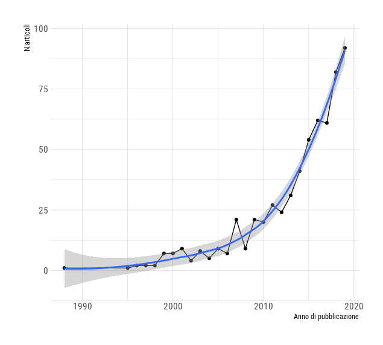
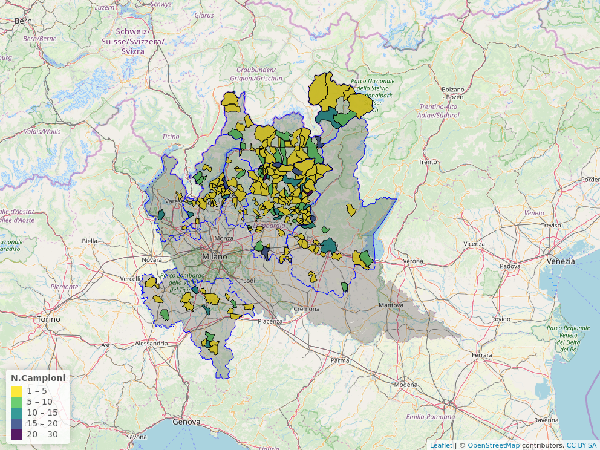
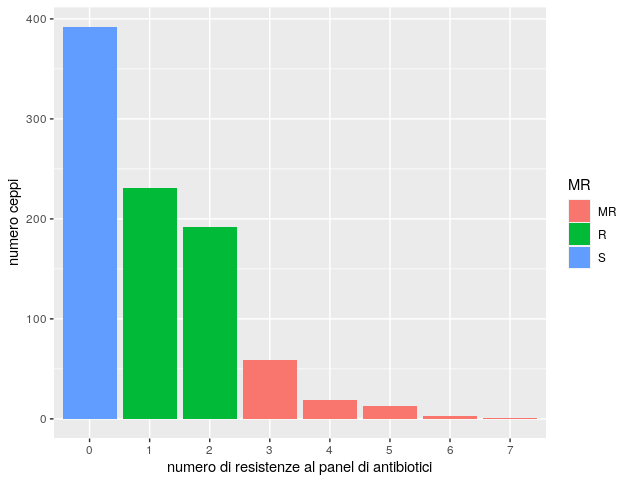

\listoffigures
\listoftables

### ELENCO DEI COLLABORATORI {-}
* **Dr. Tranquillo Vito** U.O. 1-Responsabile scientifico del progetto.Coordinamento delle U.O., Analisi statistica dei dati fenotipici. 
* **Dr. Fiocchi Alfredo** U.O. 1-Analisi microbiologiche e antibiogrammi.
* **Dr. Pongolini Stefano** U.O. 2-Coordinamento U.O. e attività di analisi metagenomiche
* **Dr. Bolzoni Luca** U.O. 2-Attività analisi metagenomiche e analisi dati
* **Dr. Erika       ** U.O. 2-Attività analisi metagenomiche e analisi dati
* **Dr. Bertoletti Irene** U.O. 3-Analisi Microbiologiche e antibiogrammi
* **Dr. Alessandro Bianchi** U.O. 3-Analisi Microbiologiche e antibiogrammi
* **Dr. Loris Alborali** U.O. 4-Analsi genomiche ceppi Ceftiofur resistenti
* **Dr. Prati Paola** U.O. 5- Attività di raccolta e invio campioni a U.O.1 per successive analisi
* **Dr. Gianni Sala** U.O. 6- Attività di raccolta e invio campioni a U.O.1 per successive analisi

\newpage

# RELAZIONE FINALE VERSIONE INTEGRALE {-}

# INTRODUZIONE (max 5 pagine)
L'Antibiotico-Resistenza (AR) è una grave minaccia per la salute umana, in quanto compromette la capacità di trattare le infezioni sia in medicina umana che veterinaria. La resistenza agli antibiotici si sviluppa attraverso complessi meccanismi come la mutazione sotto la pressione selettiva derivante dall'uso/abuso di antibiotici nel trattamento delle forme infettive batteriche o all'uso metafilattico o come promotori della crescita in zootecnia (pratica oramai illegale nella EU). La diffusione dell'antibiotico-resistenza è attribuita a scambi di DNA inter e intra-specifici, prinicipalmente attraverso il trasferimento orizzontale di geni di resistenza localizzati su plasmidi che rappresenta il più importante meccanismo all'origine dell'acquisizione della resistenza in batteri patogneni rilevanti per la salute umana (Carattoli 2013). 

La principale strategia per ridurre l'incidenza del fenomeno antibiotico-resistenza si basa sulla riduzione dell'uso degli antibiotici sia nell'uomo che negli animali domestici, considerando che risulta chiaro che entrambi i comparti sono strettamente collegati e copartecipano al mantenimento e alla diffusione di batteri resistenti e di geni di resistenza (Angulo 2004). Queste misure si basano sul presupposto che la resistenza antimicrobica è associata a costi di idoneità 
(chiedere a PIPPO come tradurre)che consentono ai batteri sensibili di superare quelli resistenti, quando non esiste una pressione selettiva legata ai farmaci antimicrobici, anche se sembra che questi costi siano estremamente variabili (Andersson & Hughes 2010) e possano essere ridotti o addirittura trasformati in benefici per il fitness da mutazioni compensative (Luo et al. 2005). 

Va ricordato che batteri portatori di geni di resistenza si trovano naturalmente nei suoli in assenza di farmaci antimicrobici antropogenici a causa della produzione naturale di molecole antibiotiche da parte di alcuni batteri e funghi (Keen & Montforts 2012). Il serbatoio di geni di resistenza nell'ambiente è quindi un mix di resistenza naturale e quella dovuta alle deiezioni di animali e uomini, a cui si possono aggiungere gli effetti selettivi di inquinanti, che possono co-selezionare elementi genetici mobili che trasportano più geni di resistenza.

I dati disponibili mostrano che numerose specie di animali selvatici sono portatori di  batteri antimicrobici resistenti  in una vasta gamma di habitat, il che solleva la questione del loro ruolo nelle dinamiche di diffusione e mantenimento all'interfaccia tra popolazioni umane, animali domestici ed ecosistemi naturali.
La presenza nella fauna selvatica, normalmente non sottoposta a trattamenti antibiotici, di ceppi batterici resistenti e in generale di geni di resistenza, è verosimilmente attribuibile a fenomeni di contaminazione ambientale. 
Per definire il ruolo della fauna selvatica nel complesso meccanismo di diffusione e mantenimento dell'antibiotico resistenza è necessario acquisire informazioni relativamente a i) Quali specie di batteri sono le più frequentemente trovate resistenti ai farmaci antimicrobici nei vertebrati selvatici? (ii) In che modo le specie selvatiche vengono colonizzate dall'AMRB e quali scambi di tali batteri avvengono tra l'uomo, gli animali domestici e la fauna selvatica? (iii) Cosa caratterizza gli habitat più contaminati dall'AMR? (iv) Quali tratti ecologici o di storia della vita, se presenti, favoriscono la colonizzazione e la potenziale infezione da AMRB nella fauna selvatica?


alla prevalenza di animali selvatici portatori di ceppi batterici resistenti nelle differenti specie e come questa varia in base all'etologia ed ecologia delle specie ospite. La caratterizzazione fenotipica e genotipica dei batteri isolati da specie selvatica e la prevalenza di ceppi resistenti e multiresistenti. La necessità di colmare le evidenze scientifiche di questo tipo ha portato ad un incremento di studi sull'argomento, comportando nell'arco di una decina d'anni l'accumulo di evidenze che aiutano a definire meglio il ruolo della fauna selvatica nella diffusione e nel mantenimento dell'antibiotico-resistenza.

L'interesse per il ruolo della fauna selvatica nella diffusione e nel mantenimento dell'antibiotico-resistenza è aumentato nel corso degli ultimi 10 anni, con un costante aumento della produzione scientifica, come evidenziato in (Fig\ref{fig:figA}). La principale preoccupazione nasce dal timore che l'eventuale dimostrazione di un ruolo della fauna selvatica come "serbatoio" e "mantenimento" di batteri portatori di geni di resistenza, contribuendo alla contaminazione ambientale di batteri resistenti o materiale genetico di resistenza (resistoma), possa compromettere gli sforzi messi in atto, soprattutto in questi ultimi anni, in campo medico e veterinario per ridurre la diffusione del fenomeno della resistenza agli antibiotici. 


Una scoping review  pubblicata nel 2015 [@greig_scoping_2015], ha evidenziato la presenza di 866 articoli di ricerca primaria; Oltre il 90% erano studi osservazionali; la maggioranza riportano i dati di prevalenza per AR nella fauna selvatica (551/866, 63.6%). Ci sono stati 176 di 866 (20,3%) studi  di genotipizzazione.   AR è stata più frequentemente studiata in E. coli 150 di 866 (17,3%), Salmonella 83 di 866 (9,6%) e Enterococcus 48 di 866 (5,5%). I gruppi della fauna selvatica più frequentemente studiati erano uccelli 410 su 866 (47,3%), cervidi, 133 di 866 (15,4%) e roditori 91 di 866 (10,5%). Solo 11 articoli hanno studiato la contaminazione dei prodotti La contaminazione ambientale è stata più frequentemente riportata per l'acqua 130 di 866 (15%). Le modalità di trasmissione dell’AR è stata riportata in 110 articoli (12,7%). Tra le caratteristiche ambientali che sono state segnalate come fattori di rischio per il trasferimento di batteri patogeni e /o AR vi sono: condivisione di ambienti  161 di 866 (18,6%), infestazione o mancanza di controllo degli uccelli selvatici 124 di 866 (14,3%) e delle fonti idriche condivise 98 di 866 (11,3%). Le pratiche di mitigazione, strategie o programmi per ridurre la trasmissione di batteri e / o AR sono stati discussi o studiati in 124 su 866 (14,3%) articoli. Sono state fornite informazioni circa i tassi di contatto tra fauna selvatica e animali domestici in 29 articoli (3,3%). È interessante notare che numerosi articoli di ricerca primaria (122/866, 14.1%) hanno riportato associazioni per i fattori di rischio di trasmissione di AR o batteri patogeni dalla fauna selvatica agli animali cibo, fonti ambientali o umani. 

Nonostante il crescente interesse e la produzione di un notevole accumulo di evidenze circa la presenza di ceppi antibiotico-resistenti nella fauna selvatica in tutto il mondo e in un'ampia varietà di specie animali non è ancora ben chiaro il ruolo epidemiologico del camparto selvatico nel mantenimento e diffusione dell'antibiotico resistenza.
A questo proposito @vittecoq_antimicrobial_2016  sottolinea quali sono i gap che la ricerca deve ancora colmare. In particolare.....


Uno dei primi lavori in Italia sull’AR nella  fauna selvatica è stato condotto da [@pagano1985faecal] in ruminanti selvatici e marmotte del parco Nazionale dello Stelvio, in cui su 121 campioni di feci esaminati furno individuati 17 ceppi di E.coli antibiotico-resistenti. Nel 1991   [@caprioli1991antimicrobial] su 81 campioni di feci da mammiferi selvatici (ruminanti, Marmotta) del Parco Nazionale dello Stelvio. Lo studio è stato focalizzato solo su Escherichia coli come microrganismo target. Sono stati osservati ceppi AR di E.coli in 17 dei 121 ceppi  presi in esame. I ceppi isolati hanno mostrato un profilo di multiresistenza. Gli Autori hanno concluso che i ceppi di E. coli in animali selvatici possono essere resistenti a diversi agenti antimicrobici e portatori di  plasmidi R, anche se il microbioma intestinale degli animali selvatici non è direttamente esposta agli antibiotici. Così una possibile fonte di AR in E.coli potrebbe essere quegli esseri umani e animali domestici che portano AMRB e condividono gli stessi habitat (turisti, animali domestici pascolo) di animali della fauna selvatica. 

Più recentemente sono stati pubblicati nuovi lavori che riguardano la presenza di antibiotico-resistenza in feci di animali selvatici in varie regioni d'Italia con particolare riferimento alle Enterobatteriacee e in particolare E.coli come microrganismo target. (citare gli articoli)


<!-- L’attività routinaria nel periodo tra il 2002 e il 2016  presso l'IZSLER mostra che sono stati eseguiti 404 antibiogrammi di ceppi di batteri isolati da animali selvatici. Tutti questi ceppi mostrano resistenza ad almeno un antibiotico. Nel 96% si è osservata multi-resistenza; 77% erano ceppi di Salmonella spp isolati da oltre 300 cinghiali. E. coli è stato il secondo ceppo più analizzato (51). Tra le altre specie di fauna selvatica indagati sono: 27 ruminanti, 22 uccelli, 42 lepri, 2 volpi e un riccio. Questi dati sono indicativi della presenza e della circolazione di ARB e ARG nella fauna selvatica delle Alpi.  -->

L'obiettivo di questo progetto di ricerca è stato quello di raccogliere informazioni sulla presenza e diffusione dell'antibiotico-resistenza in ceppi batterici della famiglia delle Enterobacteriacee isolati da feci di un ampio spettro di specie di fauna selvatica, presente in varie province della Lombardia con differenti gradi di urbanizzazione e la caratterizzazione fenotipica del profilo di resistenza dei ceppi isolati e quella genotipica utilizzando metodiche di analisi metagenomica di pool di ceppi batterici. 

\newpage
# MATERIALE E METODI (max 10 pagine)

## Campionamento
Si è proceduto ad un campionamento non probabilistico di convenienza utilizzando sia i campioni raccolti durante le attività di sorveglianza del piano regionale fauna selvatica della Lombardia (cinghiali,
ruminanti selvatici, lagomorfi, volatili) , sia i campioni provenienti da attività di sorveglianza del piano CWD (cervi e caprioli) e del piano West Nile Disease (Cornacchie, Gazze). I campioni di feci raccolti dall'intestino degli animali  sono stati stoccati a temperatura di congelamento in attesa di essere processati.


## Esami microbiologici
L’esame batteriologico è stato eseguito seguendo le indicazioni riportate nel metodo di prova interno    IZSLER che descrive la tecnica microbiologica per la categorizzazione di isolati batterici
aerobi/anaerobi facoltativi. I campioni di feci confezionati in sacchetti o barattoli o prelevati direttamente in sede necroscopica dall'intestino, sono stati disciolti in brodo di pre-arricchimento APT (acqua peptonata) e, dopo l’allestimento di tamponi, sono stati seminati su MC-Conkey Agar (terreno selettivo per enterobatteriacee) e incubati per 24-48 ore a 37°C in aerobiosi al fine di ottenere colonie isolate. Da una colonia isolata sono state realizzate colture su terreno solido Klieger Iron Agar (KIA) da utilizzare nelle successive prove di caratterizzazione (morfologica, colturale, biochimica). Il KIA costituisce un terreno differenziale impiegato principalmente come ausilio nell’identificazione di alcuni membri della famiglia delle Enterobacteriaceae. La differenziazione degli enterobatteri avviene in base alla loro capacità di fermentare il destrosio ed il lattosio e di produrre idrogeno solforato.  Tutti i campioni sono stati successivamente sottoposti alla prova della citocromo ossidasi. Quelli risultanti ossidativi e fermentativi alla coltura su terreno Klieger sono stati testati per confermare fossero E.Coli (ossidasi negativo). I campioni risultati ossidasi positivi sono stati invece identificati con analisi biochimica mediante gallerie utilizzando il kit Microgen TM GnA + B-ID System.

## Antibiogrammi
Gli antibiogrammi sono stati eseguiti mediante la  “tecnica di diffusione in agar” descritta nel metodo di prova interno per l’esecuzione dell’antibiogramma dell’Istituto Zooprofilattico della Lombardia e dell’Emilia Romagna, redatto in conformità con le linee guida nazionali del Centro di Referenza per l’Antibiotico Resistenza (CRAB) e le linee guida internazionali del Clinical and Laboratory
Standards Institute (CLSI). 
E' stato utilizzato un panel di 7 antibiotici scelti sulla base  delle Linee Guida per l'interpretazione delle prove di sensibilità ai chemioantibiotici del Centro di Referenza Nazionale per l'Antibiotico-resistenza. Le molecole selezionate sono indicate come molecole prototipo rappresentative delle diverse classi farmacologiche:

Ampicillina (AMP). Molecola prototipo di  Beta-lattamici tipo Amoxicillina, Etacillina. Antibiotico classificato come Critical I..... dal....
    
Tetraciclina (TET). Molecola prototipo di Clortetraciclina, Doxyciclina, Minociclina, Oxytetraciclina, classificato come H I dal....
    
Ceftiofur (CFT). Molecola prototipo di Cefalosporine a spettro esteso come Cefoperazone, Cefpodoxime e Cefquinome, classificate come CIA e HPCI......
    
Colistina (COL). Molecole non appartenente al panel consigliato dalla linee guida in quanto particolarmente critico per l'utilizzo in umana... e' stato inserito nel panel per verificare la presenza di resistenza a questo importante antibiotico in ceppi provenienti dalla fauna selvatica come misura del grado di contaminazione degli ambienti selvatici da parte di ceppi portatori di resistenza ......
 
Kanamicina (KAN). Molecola prototipo delle streptomicine quali Neomicina, Framicetina, classificata come CIA.....
    
Enrofloxacin (ENR). Molecola prototipo dei fluorochinolonici, tra cui Danofloxacin, Ciprofloxacin, Marbofloxacin, Orbifloxacin, Pradofloxacin. Antibiotici classificati come CIA e HPCI
    
Gentamicina (GEN). Molecola prototipo di streptomicine quali Tobramicina, Apamicina, calssificata come CIA.......
 


## Analisi metagenomiche
Le analisi metagenomiche sono state eseguite sui seguenti pools di ceppi di Escherichia coli costituiti secondo criteri di confrontabilità e rappresentatività di, area di campionamento, specie di provenienza,  e in base alla  disponibilità numerica; un ulteriore pool è costituito da ceppi di Klebsiella penumoniae di particolare interesse come patogeno nosocomiale:


## Analisi dei dati
I dati raccolti sono stati inseriti in foglio di lavoro denominato AMR in formato googlesheet e quindi importato in ambiente R (R-CRAN)  per le successive analisi.
AMR risulta costituito da 978 righe e 23 colonne. Si è proceduto ad eliminare 54 righe relative a  campioni per i quali non è stato possibile isolare alcun ceppo. 
Il dataset finale  contiene quindi le informazioni relative a 924 ceppi batterici isolati da campioni di feci di diverse specie di fauna selvatica. Complessivamente non è stato possibile l'identificazione di genere per 14 ceppi di Enterobacteriacee.  AMR contiene i seguenti 
Per le analisi sulle caratteristiche territoriali delle aree campionate è stato utili
MR-924: che contiene tutti i ceppi isolati su terreno McConkey è come tali appartenti alla famiglia delle Enterobacteriacee indipendentemente da
AMR-911: che contiene tutti i ceppi di Enterobacteriacee identificati per genere


\newpage
# RISULTATI

## QUADRO GENERALE

### Territorio
L'attività di campionamento si è svolta tra Settembre 2017 e Dicembre 2019  in sette province della Lombardia : Bergamo, Pavia, Varese,Como, Lecco e Brescia da un totale di 224 comuni (Fig\ref{fig:fig1}). 
Sulla base dei  criteri di classificazione dei comuni adottati dall'ISTAT, in merito a grado di urbanizzazione, e montanità risulta che : 415 campioni (57%) provengono da comuni a bassa urbanizzazione (aree rurali scarsamente popolate), 222 campioni (30%) da comuni a densità intermedia di popolazione e 11 campioni (1.15%) da comuni ad alta densità di popolazione; 472 campioni (65%) provengono da comuni totalmente montani, 162 (22%) da comuni in pianura e 14 campioni (2%), da aree parzialmente montane (collinari). In  tabella \ref{tab:tab1} sono riportate le statistiche descrittive della caratterizzazione geografica e di popolazione dei comuni da cui provengono i campioni. 

### Fauna selvatica
Sono stati raccolti complessivamente 729 campioni di feci da 33 differenti specie di fauna selvatica.  Le specie più frequentemente campionate sono il Capriolo (Capreolus capreolus) con 201 campioni ( 27.6%),  la Cornacchia grigia (Corvus cornix) con 133 (18.2%), il Cervo (Cervus elaphus) ,  con 83 campioni (11.4%), il Cinghiale (Sus scrofa) con 78 campioni (10.7%), il Camoscio (Rupicapra rupicapra) 49 campioni (6.7%) e il Muflone (Ovis aries musimon) 44 campioni (6.0%) che rappresentano complessivamente l'80% dei campioni esaminati. Il restante 20% è distribuito su un totale di 27 specie differenti (tabella 2). 
-distribuzione territoriale dei gruppi gruppi specie (usare ARM-istat IDcamp filtrati....)
Oltre il 90% di campioni dei gruppi-specie CERVIDI, BOVIDI e SUIDI   proviene da territori classificati da ISTAT come Totalmente Montani (TM); il 75% dei campioni del gruppo CARNIVORI proviene da territori TM; l'86% dei campioni del gruppo CORVIDI proviene da territori Non Montani (NM)e il 50% dei campioni del gruppo RAPACI proviene da territori TM e il 50% da territori NM. Per tutti i gruppi specie risulta poco rappresentata la categoria territoriale Parzialmente Montano (tabella 2b)
ISTAT sulla base della densità di popolazione per Kmq classifica i comuni in 3 classi di urbanizzazione: 1=densamente popolato, 2=mediamente popolato, 3=scarsamente popolato (rurale). La distribuzione dei campioni dei diversi gruppi specie rispetto alle caratteristiche di urbanizzazione dei comuni di provenienza riflette quanto già visto per la montanità dei territori campionati, con una più alta frequenza di campioni provenienti da territori rurali e a densità media che da comuni ad elevata densità di popolazione. In particolare dai territori a bassa urbanizzazione (rurali) proviene il 72% dei campioni del gruppo CERVIDI,  il 75% dei campioni del gruppo BOVIDI, il 67% dei campioni del gruppo SUIDI, il 70% dei campioni del gruppo CARNIVORI, il 57% dei campioni  dal gruppo CORVIDI e il 30% dal gruppo RAPACI (tabella 2c)


### Esami microbiologici
Complessivamente sono stati isolati 978 ceppi batterici, di cui 911 identificati come appartenenti alla famiglia delle Enterobacteriacee. Escherichia coli (E.coli) rappresenta il 67.6% dei ceppi isolati, il restante 32% dei ceppi è ditruibuito su un totale di 14 generi differenti ( tabella 3). Per 67 ceppi non si è giunti all'identificazione basata sulle prove biochimiche di genere. Per questi ceppi non si è proceduto ad ulteriore approfondimenti diagnostici ma sono stati comunque archiviati in glicerolo e congelatore.


### Antibiogrammi
Sono stati eseguiti 910 antibiogrammi. Complessivamente 392 ceppi (43%) sono risultati Suscettibili (S) al panel di antibiotici testati ; 423 (46%) i ceppi Resistenti (R)  fino ad un massimo di 2 antibiotici e infine 95 (10%) ceppi sono risultati Multiresistenti (MR), con resistenza a 3 o più antibiotici. La distribuzione del numero di resistenze al panel di antibiotici per isolato (Antibiogram length) mostra una decisa distribuzione asimmetrica (fig.2-hist). 


## PREVALENZA DI CEPPI ANTIBIOTICO-RESISTENTI E MULTI-RESISTENTI NELLA FAUNA SELVATICA
Complessivamente su 670 campioni di feci di fauna selvatica da cui è stato  isolato almeno un ceppo di Enterobacteriacee e su cui è stato eseguito l'antibiogramma, 421 hanno almeno un ceppo resistente ad uno o più  antibiotici del panel indagato, pari ad una Prevalenza complessiva (Overall Prevalence) del 63% (ICBayesiano: 59-66%). Nei CORVIDI si osserva la prevalenza più elevata (80%), mentre nei  BOVIDI la più bassa (37%). A causa della bassa numerosità campionaria si osservano stime con incertezza molto ampia nei gruppi : LEPRE, ALTRI VOLATILI, UCCELLI ACQUATICI, CARNIVORI e RAPACI. (fig.3)

Su 670 campioni di feci, 92 presentano almeno un ceppo MULTI-RESISTENTE (numero di resistenze >= a 3), pari ad una prevalenza del 14% (95%BCI:11%-16%). La prevalenza di animali selvatici portatori di ceppi multiresistenti varia da un minimo del 4% nel gruppo UCCELLI ACQUATICI ad un massimo del 37% nella LEPRE. La bassa numerosità dei campioni di alcuni gruppi specie rende le stime molto incerte(fig.4) 

#Per 648 campioni è risultato disponibile il dato geografico e la caratterizzazione #territoriale ISTAT. Su questi campioni è stato possibile quindi valutare la relazione #tra prevalenza di capi selvatici portatori di ceppi R  e di ceppi MR e i caratteri #territoriali di provenienza dei campioni. Per questo tipo di valutazione sono stati #esclusi i dati riferiti ai gruppi specie meno numerosi: LEPRE, UCCELLI ACQUATICI , #ALTRI VOLATILI. Dopo esclusione di questi gruppi specie, il dataset comprendeva informazioni su 628 campioni. Si è proceduto quindi ad eliminare i record con valori Missing sulle seguenti variabili: R (resistenza Si NO), densità di popolazione,e altidudine, ottenendo un dataset di 603 campioni su cui si è proceduto ad effettuare l'analisi dei dati.

I dati Istat disponibili per esplorare l'associazione tra prevalenza di capi portatori di AR e indicatori di "contaminazione" derivati dai singoli comuni sono: densità di popolazione ( da cui deriva la classificazione del grado di urbanizzazione dell'ISTAT), superficiemkq del comune, altitudine ( correlato alla densità di popolazione e alla classificazione di Montanità dell'ISTAR), superfice a pascolo, numero di capi domestici al pascolo (correlato alla superficie a pascolo), n.aziende al pascolo. 

Esistono evidenze in letteratura che la presenza (prevalenza/occorrenza ) di animali selvatici portatori di ceppi AR o MAR è da attribuire alla contaminazione ambientale e/o all'interazione tra specie doemstiche e selvatiche. Viene quindi ipotizzata una relazione inversa tra indicatori indiretti di contaminazione ambientale (urbanizzazione, densità di popolazione)e d'interazione tra specie (esempio aree dedicate al pascolo, n. capi al pascolo....ecc... alpeggio...)

Tutte le variabili quantitative predittorie sono state standardizzate in accordo a quanto suggerisce Gelman, sia per una maggior interpretabilità dei coefficienti sia per una migliore perfromance del motore HCMCM che per una miglior utilizzo delle prior del modello....

La specificazione del modello si è basata su una valutuazione DAG, che ha permesso di chiarire la dipendenza delle variabili e sceigliere quelle da inserire nel modello.

Mediante il calcolo di WAIC e PSIS ( criteri d'informazione) è' stato selezionato un modello multilevel con la variabile "comune"" con random effect (cluster di osservazioni) come predittori: Specie, Specie*Pascolo, Pascolo, Urbanizzazione. Le viariabili quantitative sono state preventivamente standardizzate.

Dal modello risulta che la probabilità che  un animale della fauna selvatica sia portatore di almeno un ceppo di Enterobacteriacie resistente ad almeno un ab del panel indagato aumenta all'aumentare della dimensione dell'area adibita a pascolo condizionalmente al gruppo specie di appartenenza, e tende ad aumentare all'aumentare della densità di popolazione per Kmq con indicatore di urbanizzazione del territorio. In tabella x sono riportate le stime a posteriori dei coefficienti di regressione e i rispettivi intervalli di credibilità. 

## CARATTERIZZAZIONE FENOTIPICA DELL'ANTIBIOTICO-RESISTENZA DEGLI ISOLATI BATTERICI
La maggior parte dei ceppi (oltre l'80%) ha mostrato resistenza nei confronti di AMP (392 ceppi 42.47%) e TET (342 ceppi 37.05%) in cui si osserva una ampia variabilità nei differenti gruppi di Specie (Fig\ref{fig:fig2}).

In particolare, escludendo i ceppi derivati da gruppi specie con ridotta dimensione del campione,  la maggior frequenza di ceppi resistenti a AMP si osserva negli isolati del gruppo  CORVIDI (58%), del gruppo CERVIDI (45%)  e RAPACI (42%); le frequenze minori si osservano nel gruppo BOVIDI (26%) e SUIDI (22%). Le resistenze alle tetracicline sono risultate più frequenti nei ceppi isolati dai CORVIDI (51%) e RAPACI (48%), mentre le più basse in isolati da  SUIDI (34%), CERVIDI(32%), BOVIDI(20%). 

Nei confronti della COLISTINA, antibiotico di particolare interesse in ambito clinico umano, classificato come..... si osserva una bassa frequenza di ceppi resistenti da un minimo dello 0.5% osservato nei ceppi isolati dai SUIDI, ad un massimo del 16% osservato sia nei RAPACI che nella LEPRE. Anche per il CEFTIOFUR , cefalosporina di 3 generazione nei confronti dei quali si è diffusa a livello mondiale la selezione di ceppi ESBL... si osserva una bassa prevalenza di ceppi resistenti: minimo 2.1% negli UCCELLI ACQUATICI, massimo 24% nei RAPACI.
La GEN risulta l'antibiotico verso cui gli isolati si sono mostrati in modo uniforme tra le differenti specie meno resistenti (12 ceppi 1.30%). Anche per ENR e KAN si osserva una bassa e uniforme prevelenza di ceppi resistenti tra i diversi gruppi specie.
(tabella 4)

Il profilo di resistenza tra i differenti generi di ceppi isolati conferma che AMP e TET sono gli antibiotici verso i quali la maggior parte degli isolati mostra la maggior frequenza di resistenze (tabella 5).
    
Si osservano 39 differenti profili di co-resistenza (da 1 a più AB) (fig.6). I profili più frequenti risultano: TET-AMP (141 ceppi), AMP (130 ceppi), TET (85 ceppi), CFT-TET-AMP (27 ceppi), COL-TET-AMP (14 ceppi), COL-TET (12 ceppi) e CFT-TET (12 ceppi), che rappresentano più dell'80% dei ceppi. Il restante 20% è distribuito nei restanti 32 profili.

Diversità ecologica dei differenti profili di antibiotico-resistenza
La figura 6 illustra la distribuzione dei ceppi in base al profilo di co-resistenza e la specie di fauna selvatica da cui provengono. Si può osservare la "rarità" di molti profili presenti solo in determinati gruppi Specie. Complessivamente si osserva una scarsa uniformità di profili tra i gruppi specie, con una particolare ricchezza di differenti profili nel gruppo CERVIDI e CORVIDI che sono i più rappresentati ma anche nei ceppi isolati dai RAPACI sebbene in numero sensibilmente più ridotto rispetto ai precedenti.

Gli indici di diversità (tab.6)sono riassunti in un grafico di Renyi entropy standardizzato (fig.7). Nella popolazione di CERVIDI si osserva un profilo di dominanza in termini di diversità con una minore diversità di profili di co-resistenza con una forte dominanza di pochi profili.
AL contrario i gruppi specie BOVIDI, SUIDI, CARNIVORI, LEPRE, UCCELLI ACQUATICI e ALRI VOLATILI, mostrano un profilo di uniformità (evenness), quindi caratterizzato da maggiore diversità senza la presenza di profili di co-resistenza relativamente dominanti. 
Le popolazione di CORVIDI e RAPACI mostrano un sovrapponibile profilo di diversità intermedio rispetto a quello di dominanza dei CERVIDI e di evenness degli altri gruppi-specie. 


#interazione selvatici-domestici? dati di sondrio confronto (da fare)

    
Caratterizzazione genomica dei ceppi ceftiofur-resistenti
La resistenza dei ceppi isolati al Ceftiofur è risultata poco frequente (prev.....)

## POOL METAGENOMICI

\newpage

# DISCUSSIONE E CONCLUSIONI (max 10 pagine)

\newpage


\newpage
# Raccomandazioni (max 2 pagine)
### elementi gestionali e/o diagnostici
### indicazioni per la ricerca
### sugg per eventuali provvedimenti normativi

# MODALITÀ DI DIVULGAZIONE DEI RISULTATI (1 pagina)

\newpage

**ELENCO FIGURE**
```{r echo=FALSE, figA, fig.align = "center",out.width = '80%', fig.cap="Andamento annuale del numero di pubblicazioni relative all'AMR nella fauna selvatica."}


```


```{r echo=FALSE, fig1, fig.align = "center",out.width = '80%', fig.cap="Comuni di provenienza dei campioni"}


```

```{r echo=FALSE, fig2, fig.align = "center",out.width = '80%', fig.cap="distribuzione numero di resistenze al panel di antibiotici"}


```

\pagebreak

**ELENCO TABELLE** 

 
\begin{table}[h]
\centering
\caption{Caratterizzazione dei comuni di provenienza dei campioni}
\label{tab:tab1}
\begin{tabular}{l|r|r|r|r|r|r|r}
\hline
Parametri & min & q25 & median & q75 & max & mean & sd\\
\hline
Superficie (Kmq) & 1.97 & 10.6 & 17.1 & 29.2 & 227 & 29.8 & 43.9\\
\hline
Densità di popolazione (Ab/Kmq) & 4.02 & 45.1 & 128.1 & 257.1 & 2210 & 250.7 & 357.3\\
\hline
Altitudine mediana & 48.00 & 185.0 & 600.0 & 1120.0 & 2650 & 773.3 & 684.6\\
\hline
Superficie al pascolo (ettari) & 0.09 & 11.0 & 60.0 & 170.9 & 2630 & 178.8 & 338.8\\
\hline
Aziende con pascolo & 1.00 & 3.0 & 8.0 & 16.0 & 425 & 12.6 & 20.3\\
\hline
Capi al pascolo & 2.00 & 52.0 & 133.0 & 293.0 & 8429 & 307.1 & 602.7\\
\hline
\end{tabular}
\end{table}
 

\begin{table}[!h] 
\centering
\caption{Distribuzione del numero e in \% delle differenti specie di fauna selvatica di origine dei campioni di feci}
\begin{tabular}{l|l|r|r}
\hline
Gruppo & SPECIE & n & \%\\
\hline
CERVIDI & CAPRIOLO & 201 & 70.53\\
\hline
CERVIDI & CERVO & 83 & 29.12\\
\hline
CERVIDI & DAINO & 1 & 0.35\\
\hline
BOVIDI & CAMOSCIO & 49 & 49.49\\
\hline
BOVIDI & MUFLONE & 44 & 44.44\\
\hline
BOVIDI & STAMBECCO & 6 & 6.06\\
\hline
CARNIVORI & TASSO & 5 & 20.83\\
\hline
CARNIVORI & VOLPE & 19 & 79.17\\
\hline
SUIDI & CINGHIALE & 78 & 100.00\\
\hline
LEPRE & LEPRE & 4 & 100.00\\
\hline
CORVIDI & CORNACCHIA & 133 & 88.67\\
\hline
CORVIDI & GAZZA & 13 & 8.67\\
\hline
CORVIDI & GHIANDAIA & 4 & 2.67\\
\hline
RAPACI & ALLOCCO & 3 & 4.41\\
\hline
RAPACI & ASSIOLO & 2 & 2.94\\
\hline
RAPACI & CIVETTA & 15 & 22.06\\
\hline
RAPACI & CIVETTA NANA & 1 & 1.47\\
\hline
RAPACI & FALCO PECCHIAIOLO & 7 & 10.29\\
\hline
RAPACI & GHEPPIO & 13 & 19.12\\
\hline
RAPACI & GUFO REALE & 4 & 5.88\\
\hline
RAPACI & NIBBIO BRUNO & 1 & 1.47\\
\hline
RAPACI & POIANA & 8 & 11.76\\
\hline
RAPACI & SPARVIERO & 14 & 20.59\\
\hline
UCCELLI ACQUATICI & CIGNO REALE & 3 & 20.00\\
\hline
UCCELLI ACQUATICI & CORMORANO & 1 & 6.67\\
\hline
UCCELLI ACQUATICI & FENICOTTERO & 1 & 6.67\\
\hline
UCCELLI ACQUATICI & FOLAGA & 1 & 6.67\\
\hline
UCCELLI ACQUATICI & GABBIANO & 1 & 6.67\\
\hline
UCCELLI ACQUATICI & GABBIANO REALE & 1 & 6.67\\
\hline
UCCELLI ACQUATICI & GERMANO REALE & 7 & 46.67\\
\hline
ALTRI VOLATILI & FAGIANO & 3 & 50.00\\
\hline
ALTRI VOLATILI & PICCIONE & 2 & 33.33\\
\hline
ALTRI VOLATILI & STARNA & 1 & 16.67\\
\hline
\end{tabular}
\end{table}


\newpage
# Bibliografia
